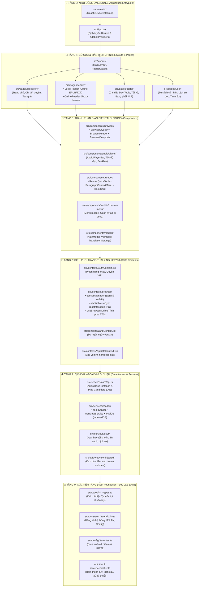

# 📱 Tiên Hiệp AI — Frontend Web, Desktop & Mobile Native

> **Đường dẫn thư mục:** `frontend/`  
> **Nền tảng công nghệ:** React 18, TypeScript 5, Vite, Capacitor Native Bridge (iOS/Android), Electron (Desktop), Vanilla CSS Design System  
> **Kiến trúc cốt lõi:** Kiến Trúc Cây Phân Cấp Đơn Chiều (Single-Directional Rooted Tree) & Fractal Modular Clean Architecture ($\le 7$ files/thư mục, $\le 300$ dòng/tệp)  
> **Nguyên tắc bảo vệ:** 100% On-Device / Local LAN Processing — Zero Circular Dependencies — Zero Cloud Dependency.

---

## 🏛️ 1. Quy Luật Kiến Trúc Cây Phân Cấp Đơn Chiều (Root-to-Leaf Tree Architecture)

Toàn bộ mã nguồn giao diện được tổ chức theo cấu trúc cây nghiêm ngặt với 6 tầng độ sâu. Mọi luồng phụ thuộc (import) chỉ được phép đi **MỘT CHIỀU DUY NHẤT TỪ NGỌN VỀ GỐC** (Downward Imports). Tuyệt đối nghiêm cấm việc tầng gốc hoặc tầng thân gọi ngược lên tầng trên!



---

## 🔍 2. Quy Trình Truy Vết Lỗi Từ Gốc Đến Ngọn (Root-to-Leaf Debugging Flow)

Khi gặp bất kỳ sự cố hoặc lỗi phát sinh trong hệ thống, lập trình viên/Agent **không được đoán mò ở tầng ngọn**, mà phải lần lượt rà soát từ tầng Gốc đi xuống:

```text
[PHÁT SINH LỖI]
      │
      ▼
1. KIỂM TRA GỐC (Level 0: src/types, src/constants, src/utils)
   ↳ Kiểm tra kiểu dữ liệu có bị lệch contract? Config IP máy chủ LAN có đúng?
   ↳ Thuật toán tách câu sentenceSplitter có chuẩn?
      │ (Gốc hoàn toàn đúng)
      ▼
2. KIỂM TRA THÂN (Level 1: src/services, src/services/reader/localDb)
   ↳ API Endpoint có nhận diện đúng Candidate Server? Dữ liệu IndexedDB có lưu trọn vẹn?
   ↳ Axios interceptor có gắn Bearer token chuẩn?
      │ (Thân hoàn toàn đúng)
      ▼
3. KIỂM TRA CÀNH (Level 2: src/contexts/browser, AuthContext)
   ↳ State có được cập nhật đúng? Reducer / Hooks có giữ ref chính xác?
   ↳ Quản lý Tab stack (A-B-D) có xóa đúng tab thừa?
      │ (Cành hoàn toàn đúng)
      ▼
4. KIỂM TRA NHÁNH (Level 3: src/components/browser, components/audio)
   ↳ Props truyền vào component có bị thiếu? Event handler onClick/onTouch có kết nối đúng?
      │ (Nhánh hoàn toàn đúng)
      ▼
5. KIỂM TRA LÁ (Level 4: src/pages/reader, src/pages/discovery)
   ↳ Lỗi giao diện render ở view hoặc bố cục CSS màn hình.
```

---

## 📂 3. Cấu Trúc Thư Mục Chuẩn Hóa

```plaintext
frontend/
├── dist-web/                  # Bundle đầu ra tối ưu cho Production
├── ios/                       # Dự án Xcode Capacitor cho iOS (iPhone/iPad)
├── android/                   # Dự án Android Studio Capacitor cho Android
├── electron/                  # Tệp điều khiển tiến trình Desktop Electron (main.cjs)
├── public/                    # Tài nguyên tĩnh & injected_bundle.js
├── src/
│   ├── assets/                # Hình ảnh, biểu tượng vector SVG, font
│   ├── components/            # TẦNG 3: Thành phần giao diện dùng chung
│   │   ├── audio/             # Trình phát thanh TTS, Seekbar, Bộ chọn tốc độ
│   │   ├── browser/           # Giao diện trình duyệt web (Header, Viewports, Modals, Overlay)
│   │   ├── common/            # Nút bấm, Footer, Modal xác nhận, ErrorBoundary
│   │   ├── mobile/            # Menu di động, Trình chuyển đổi tab Chrome
│   │   ├── modals/            # Modal đăng nhập, Nâng cấp VIP, Cài đặt dịch
│   │   ├── reader/            # Công cụ đọc nhanh, Menu đoạn văn, Thẻ sách
│   │   └── vip/               # Nút khoá tính năng VIP, Hộp thoại nâng cấp
│   ├── config/                # TẦNG 0: Định tuyến trang (APP_ROUTES)
│   ├── constants/             # TẦNG 0: Cấu hình địa chỉ Server (Local, LAN Wi-Fi)
│   ├── contexts/              # TẦNG 2: Quản lý trạng thái toàn cục (Auth, Browser, Lang, VIP)
│   ├── hooks/                 # TẦNG 2: Custom hooks nghiệp vụ tái sử dụng
│   ├── layouts/               # TẦNG 4: Bố cục bao bọc (MainLayout, ReaderLayout)
│   ├── pages/                 # TẦNG 4: Các màn hình ứng dụng (Discovery, Reader, Portal, User)
│   ├── services/              # TẦNG 1: Giao tiếp API mạng, IPC và IndexedDB DAO
│   ├── types/                 # TẦNG 0: Hệ thống kiểu TypeScript toàn cục
│   ├── utils/                 # TẦNG 0: Hàm tiện ích thuần túy (Tách câu, Nhận diện thiết bị)
│   ├── App.tsx                # TẦNG 5: Khởi tạo điều hướng & bọc Global Contexts
│   ├── main.tsx               # TẦNG 5: Điểm khởi động ReactDOM
│   └── index.css              # Hệ thống Token màu sắc & CSS Design System
└── tests/                     # Bộ kiểm thử hồi quy tự động giao diện & audio player
```

---

## ⚡ 4. Lệnh Khởi Chạy & Kiểm Định Chất Lượng

```bash
# 1. Chạy môi trường Web Development
npm run dev

# 2. Chạy ứng dụng Desktop Electron
npm run electron

# 3. Đồng bộ & mở dự án Xcode iOS (iPhone)
npx cap sync ios
npx cap open ios

# 4. Kiểm tra chất lượng kiến trúc tự động (Quality Gates)
node ../scripts/verify_tree_architecture.js   # Xác nhận 0 Upward Imports
node ../scripts/check-line-limit.js --all     # Xác nhận tất cả file ≤ 300 dòng
node ../scripts/check-folder-health.js --all  # Xác nhận tất cả folder ≤ 7 files
npx madge --circular src --extensions ts,tsx  # Xác nhận 0 vòng phụ thuộc
```
