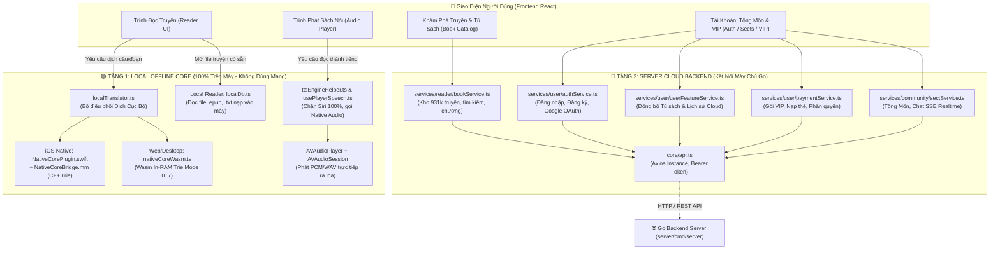

# 🏛️ KIẾN TRÚC PHÂN TÁCH ĐỘC LẬP: LOCAL OFFLINE CORE VS SERVER CLOUD BACKEND

> **Tài liệu chuẩn hóa kiến trúc Frontend Tiên Hiệp AI**  
> **Nguyên tắc bất di bất dịch:** Tách biệt tuyệt đối giữa **Lõi AI Chạy Cục Bộ 100% Trên Thiết Bị (Local In-RAM / Offline Engine)** và **Hệ Thống Dịch Vụ Máy Chủ Đám Mây (Backend Server / Cloud)**. Không bao giờ để lẫn lộn hai luồng logic này.

---

## 📊 1. BẢNG SO SÁNH PHÂN ĐỊNH RANH GIỚI 2 THẾ GIỚI

| Tiêu Chí | 🟢 TẦNG LOCAL OFFLINE NATIVE CORE | 🔵 TẦNG SERVER CLOUD BACKEND |
| :--- | :--- | :--- |
| **Bản chất** | **100% On-Device / In-RAM Engine** | **Hệ thống Máy chủ Go Trung tâm (`server/`)** |
| **Môi trường chạy** | Trực tiếp trong tiến trình của thiết bị (In-Process) | Chạy trên Máy chủ / VPS hoặc Localhost (`5051`) |
| **Yêu cầu Internet** | **ZERO (Hoạt động cả khi Bật Chế Độ Máy Bay)** | Cần kết nối Internet / Mạng đến Server |
| **Tốc độ xử lý** | Siêu tốc: Dịch $< 1\text{ms}$, TTS $< 50\text{ms}$ | Phụ thuộc độ trễ mạng (Ping ~50 - 200ms) |
| **Công nghệ cốt lõi** | • C++ Native Core (Objective-C++ / Swift trên iOS) • WebAssembly (`native-core.wasm`) trên Web • C++ MaxMatch Trie Vietphrase & Hán Việt • C++ Matcha TTS Audio Synthesizer (`AVAudioPlayer`) • IndexedDB / SQLite Offline Cache | • Golang HTTP Router (`net/http`) • SQLite WAL Database (931.000 Truyện) • Google OAuth 2.0 & JWT Authentication • Server-Sent Events (SSE Realtime Stream) • ACID Payment & VIP Subscription Gate |
| **Mã nguồn Frontend** | • `src/utils/localTranslator.ts` • `src/core/wasm/` • `src/components/audio/player/` • `src/pages/reader/local-reader/` | • `src/services/user/authService.ts` • `src/services/reader/bookService.ts` • `src/services/user/paymentService.ts` • `src/services/community/sectService.ts` • `src/core/api.ts` |

---

## 🗺️ 2. SƠ ĐỒ ĐIỀU PHỐI HAI TẦNG LOGIC (TWO-TIER FLOW)

---

## 🔍 3. CHI TIẾT TỪNG TẦNG LOGIC

### 🟢 TẦNG 1: LOCAL OFFLINE NATIVE CORE

#### 1. Dịch Thuật C++ In-RAM (`src/utils/localTranslator.ts`)
- **Nguyên tắc:** Tuyệt đối không gửi văn bản qua HTTP ra ngoài.
- **Trên Thiết bị iOS/Android Native:**
  - Gọi thẳng `Capacitor.Plugins.NativeCore.translate({ text, mode })`.
  - Tầng Swift chuyển sang Objective-C++ `NativeCoreBridge.mm` $\rightarrow$ gọi thẳng hàm C++ `NativeCore_Translate` (Trie Engine / Modes 0..7).
  - Tốc độ: $< 1\text{ms}$ cho mỗi câu, bộ nhớ được Apple ARC tự động dọn dẹp.
- **Trên Web Browser / Desktop:**
  - Nạp module WebAssembly `native-core.wasm` trực tiếp vào RAM trình duyệt.
  - Gọi hàm `wasmTranslate(text)` chạy In-Process.

#### 2. Giọng Đọc Sách Nói Offline (`src/components/audio/player/`)
- **Nguyên tắc:** Chặn 100% Apple Siri / Web SpeechSynthesis (`window.speechSynthesis.speak = () => {}`).
- **Phát âm thanh:**
  - Trên iOS: Sử dụng `NativeCorePlugin.swift` tích hợp `AVAudioPlayer` phát dữ liệu WAV/PCM trực tiếp ra loa, kích hoạt `AVAudioSession` phát nền khi tắt màn hình.
  - Trên Desktop: Kết nối daemon nội bộ `127.0.0.1:5051/api/tts/speak`.

#### 3. Trình Đọc Truyện Cục Bộ (`src/pages/reader/local-reader/`)
- Đọc các file sách `.epub`, `.txt` do người dùng tự nạp từ bộ nhớ máy hoặc iCloud Drive.
- Lưu trữ trong IndexedDB của trình duyệt / bộ nhớ ứng dụng di động (`localDb.ts`).
- Người dùng có thể đọc trọn đời mà không cần mạng Internet.

---

### 🔵 TẦNG 2: SERVER CLOUD & COMMUNITY BACKEND

Tầng này phục vụ toàn bộ các tính năng tương tác mạng xã hội, dữ liệu dùng chung và bảo mật tài khoản:

#### 1. Kho Sách Trực Tuyến 931k Truyện (`src/services/reader/bookService.ts`)
- `getBooks(params)`: Tìm kiếm tiểu thuyết theo tên, tác giả, thể loại.
- `getBookDetail(id)`: Lấy thông tin giới thiệu, tác giả, trạng thái truyện.
- `getChapterContent(bookId, chapterIdx)`: Tải nội dung chương truyện online từ nguồn mạng.

#### 2. Tài Khoản & Xác Thực (`src/services/user/authService.ts`)
- `login`, `register`, `logout`: Đăng nhập, đăng ký bằng Email & Mật khẩu.
- `googleLogin`: Xác thực tài khoản Google OAuth 2.0 an toàn.
- `getMe`: Lấy thông tin hồ sơ và quyền hạn của đạo hữu.

#### 3. Đồng Bộ Đám Mây (`src/services/user/userFeatureService.ts`)
- Lưu trữ Tủ sách yêu thích và Lịch sử đọc lên server để đồng bộ khi đổi từ iPhone sang máy tính hoặc iPad.

#### 4. Tông Môn & Trò Chuyện Thời Gian Thực (`src/services/community/`)
- Tạo phái, gia nhập tông môn, cống hiến tu vi.
- Nhóm chat tu tiên kết nối qua Server-Sent Events (SSE Realtime Stream).

#### 5. Thành Viên VIP & Thanh Toán (`src/services/user/paymentService.ts`)
- Đăng ký gói VIP (Tháng, Quý, Năm) để mở khóa các đặc quyền tu tiên.
- Xác thực thanh toán an toàn qua cổng thanh toán Backend Go.

---

## 🛡️ 4. NGUYÊN TẮC BẢO VỆ KIẾN TRÚC CHO LẬP TRÌNH VIÊN

1. **Tuyệt đối không đưa logic gọi mạng vào tầng Local Engine:**
   - Trong `localTranslator.ts`, `nativeCoreWasm.ts`, `NativeCorePlugin.swift`, không được phép viết bất kỳ hàm `fetch()` hay `axios` nào gửi văn bản dịch ra ngoài server.
2. **Tuyệt đối không fallback sang dịch vụ hệ thống của bên thứ 3:**
   - Cấm gọi `window.speechSynthesis` (Siri của iPhone) hoặc các API dịch đám mây công cộng.
3. **Khi cập nhật mã nguồn C++ mới từ dự án khác:**
   - Chỉ copy file `.cpp`, `.h` vào thư mục `native-core/`.
   - Cập nhật hàm bọc trong `NativeCoreBridge.h` và `NativeCoreBridge.mm`.
   - Tầng Server Cloud trong `src/services/` hoàn toàn đứng độc lập và không bị ảnh hưởng.
