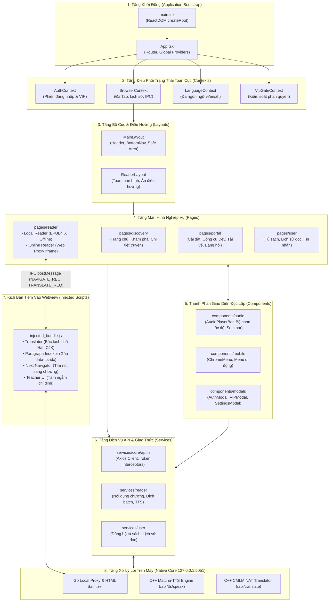
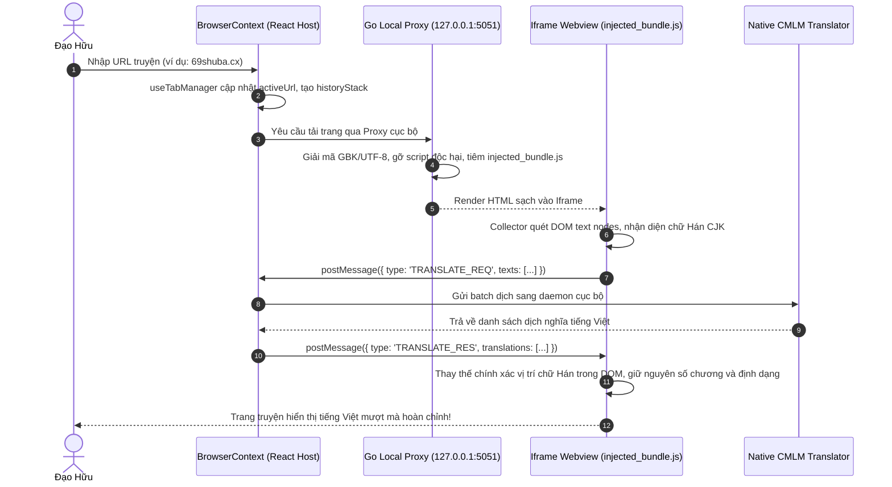

# 📁 Thư Mục Gốc Mã Nguồn Giao Diện (Frontend Source Root)

> **Đường dẫn thư mục:** `frontend/src`  
> **Nền tảng công nghệ:** React 18, TypeScript 5, Vite, Capacitor Native Bridge, Vanilla CSS Design System  
> **Mô hình kiến trúc:** Fractal Modular Clean Architecture (Giới hạn nghiêm ngặt $\le 7$ files/thư mục, $\le 300$ dòng/tệp mã nguồn)  
> **Tài liệu phân rã chi tiết:** Xem [`KIEN_TRUC_PHAN_TACH_LOCAL_VA_SERVER.md`](./KIEN_TRUC_PHAN_TACH_LOCAL_VA_SERVER.md) để nắm rõ ranh giới giữa Lõi C++ Cục Bộ (Offline) và Máy Chủ Đám Mây (Online).  
> **Nguyên tắc bảo vệ:** Tách biệt tuyệt đối 100% On-Device Native Processing (Dịch & TTS) khỏi Server Cloud Backend (Auth & Kho Sách).

---

## 📌 Tổng Quan Hệ Thống

`frontend/src` là trung tâm điều hành toàn bộ giao diện người dùng và nghiệp vụ tương tác của ứng dụng **Tiên Hiệp AI**. Kiến trúc được phân định làm 2 tầng tách biệt:
1. **🟢 Tầng Lõi AI Chạy Cục Bộ (Local In-RAM Engine):** Dịch thuật AI (Trie, Modes 0..7) và Giọng đọc Matcha TTS chạy trực tiếp trong tiến trình C++ (iOS Swift) hoặc Wasm In-RAM. Không cần Internet, không phụ thuộc server mạng.
2. **🔵 Tầng Dịch Vụ Máy Chủ (Server Cloud Backend):** Kết nối Backend Go (`server/`) phục vụ kho 931k truyện, đăng nhập tài khoản, tủ sách đám mây, bang hội tông môn và gói VIP.

---

## 📊 Sơ Đồ Kiến Trúc Toàn Diện (System Architecture & Module Flow)

---

## 🔄 Luồng Giao Tiếp Dữ Liệu Xuyên Suốt (End-to-End Data Pipeline)

### Luồng Đọc Truyện Web & Dịch Thuật Tự Động:

---

## 📂 Danh Sách Thư Mục & Vai Trò Trong Kiến Trúc Fractal

| Thư mục | Kiến Trúc & Mục Đích Chức Năng |
| :--- | :--- |
| [`assets/`](file:///home/alida/Documents/Extension_reader_tool/ttS/frontend/src/assets/README.md) | Lưu trữ hình ảnh tĩnh, SVG icons, banner anh hùng (`hero_banner.png`), logo ứng dụng. |
| [`components/`](file:///home/alida/Documents/Extension_reader_tool/ttS/frontend/src/components/README.md) | Thư viện UI components tái sử dụng: Audio Player, Chrome Menu, Dialog Modals, Book Cards. |
| [`config/`](file:///home/alida/Documents/Extension_reader_tool/ttS/frontend/src/config/README.md) | Cấu hình tham số môi trường, thời gian timeout, cờ tính năng và phiên bản ứng dụng. |
| [`constants/`](file:///home/alida/Documents/Extension_reader_tool/ttS/frontend/src/constants/README.md) | Tập hợp hằng số hệ thống, danh mục endpoint API backend, key định danh trong `localStorage`. |
| [`contexts/`](file:///home/alida/Documents/Extension_reader_tool/ttS/frontend/src/contexts/README.md) | Tầng React Contexts toàn cục: Auth, Browser đa tab, Ngôn ngữ giao diện, Cổng kiểm soát VIP. |
| [`core/`](file:///home/alida/Documents/Extension_reader_tool/ttS/frontend/src/core/README.md) | Nền tảng lõi: Nhận diện nền tảng (iOS Capacitor / Android / Web / Desktop), giám sát kết nối mạng. |
| [`hooks/`](file:///home/alida/Documents/Extension_reader_tool/ttS/frontend/src/hooks/README.md) | Các Custom React Hooks dùng chung: đo kích thước viewport, xử lý debounce, bắt cử chỉ vuốt chạm. |
| [`layouts/`](file:///home/alida/Documents/Extension_reader_tool/ttS/frontend/src/layouts/README.md) | Khung bố cục bao bọc trang: Main Layout (với BottomNav & Safe Area), Reader Layout (toàn màn hình). |
| [`pages/`](file:///home/alida/Documents/Extension_reader_tool/ttS/frontend/src/pages/README.md) | Các màn hình trang chính: Khám phá truyện, Đọc sách (Online & Offline), Cổng cài đặt, Tủ sách cá nhân. |
| [`services/`](file:///home/alida/Documents/Extension_reader_tool/ttS/frontend/src/services/README.md) | Tầng Client API Axios kết nối backend: Reader Service, User Service, Community Service, Auth Service. |
| [`tests/`](file:///home/alida/Documents/Extension_reader_tool/ttS/frontend/src/tests/README.md) | Bộ kiểm thử chức năng tự động: kiểm tra giao ước API, kiểm thử phân quyền VIP, kiểm thử đa tab. |
| [`types/`](file:///home/alida/Documents/Extension_reader_tool/ttS/frontend/src/types/README.md) | Hệ thống định nghĩa kiểu dữ liệu TypeScript (Interfaces, Types, Enums) dùng chung cho toàn bộ dự án. |
| [`utils/`](file:///home/alida/Documents/Extension_reader_tool/ttS/frontend/src/utils/README.md) | Tiện ích hỗ trợ và bộ kịch bản tiêm vào webview (`webview-injected`: Highlighter, Teacher, Translator). |

---

## 📄 Chi Tiết Các Tệp Tin Tại Thư Mục Gốc

| Tên Tệp Tin | Dòng Code | Vai Trò & Thuật Toán Trọng Tâm |
| :--- | :---: | :--- |
| [`main.tsx`](file:///home/alida/Documents/Extension_reader_tool/ttS/frontend/src/main.tsx) | 85 | Điểm khởi đầu (Entrypoint) của ứng dụng web. Khởi tạo `ReactDOM.createRoot`, đăng ký service worker (nếu có), kiểm tra môi trường chạy và gắn kết `App` vào `#root`. |
| [`App.tsx`](file:///home/alida/Documents/Extension_reader_tool/ttS/frontend/src/App.tsx) | 90 | Component gốc cấp cao nhất. Bao bọc toàn bộ cây phân cấp bằng các Providers (`AuthProvider`, `BrowserProvider`, `LangProvider`, `VipGateProvider`) và định tuyến các màn hình chính. |
| [`index.css`](file:///home/alida/Documents/Extension_reader_tool/ttS/frontend/src/index.css) | 135 | Thiết lập hệ thống kiểu dáng toàn cục (Design System Tokens): bảng màu phong cách Tu Tiên huyền ảo, biến Safe Area bù trừ tai thỏ di động (`env(safe-area-inset-top)`), tối ưu thanh cuộn và font chữ. |
| [`App.css`](file:///home/alida/Documents/Extension_reader_tool/ttS/frontend/src/App.css) | 185 | Định nghĩa kiểu dáng cho khung chứa App, hiệu ứng chuyển cảnh mượt mà giữa các tab và tối ưu hóa khung nhìn điện thoại. |
| [`images.d.ts`](file:///home/alida/Documents/Extension_reader_tool/ttS/frontend/src/images.d.ts) | 13 | Khai báo module TypeScript cho các định dạng file tài nguyên đồ họa (`.png`, `.jpg`, `.svg`, `.webp`, `.ico`) giúp import hình ảnh an toàn không bị lỗi type. |

---

## 🌳 Quy Luật Kiến Trúc Cây Phân Cấp Đơn Chiều (Tree-Rooted Hierarchy)

Ứng dụng tuân thủ nghiêm ngặt văn kiện [TREE_DEPENDENCY_ARCHITECTURE.md](file:///home/alida/Documents/Extension_reader_tool/ttS/docs/TREE_DEPENDENCY_ARCHITECTURE.md):
- **Càng dùng chung càng ở Gốc Sâu:** Tầng Gốc (Level 0: `types`, `constants`, `config`, `core/platform`, `services/core/api.ts`) là độc lập 100%, không bao giờ import ngược từ tầng trên.
- **Nhánh chỉ gọi xuống Gốc:** Tầng Lá (Pages, Components) gọi xuống Contexts $\rightarrow$ Contexts gọi xuống Services $\rightarrow$ Services gọi xuống Core Foundation.
- **Quy trình Truy Vết Lỗi (Root-to-Leaf Debugging):** Khi có lỗi, lập tức kiểm tra từ Gốc (Foundation Core) $\rightarrow$ nếu Gốc đúng thì kiểm tra Tầng Thân $\rightarrow$ Tầng Cành $\rightarrow$ Tầng Lá, cô lập điểm lỗi trong vài giây!
- **Zero Circular Dependencies:** Toàn bộ 324+ file mã nguồn đạt trạng thái `0 circular dependencies` (kiểm tra bằng `npx madge --circular frontend/src`).

---

## ⚙️ Quy Chuẩn Chất Lượng & Cam Kết Kỹ Thuật

1. **Fractal Architecture Compliance:** Toàn bộ cây thư mục được chia nhỏ theo nguyên tắc Fractal. Không có bất kỳ thư mục nào chứa quá 7 files mã nguồn.
2. **Strict Line Limit ($\le 300$ dòng):** Mỗi tệp mã nguồn đều được kiểm soát nghiêm ngặt dưới 300 dòng bằng script tự động [`scripts/check-line-limit.js`](file:///home/alida/Documents/Extension_reader_tool/ttS/scripts/check-line-limit.js).
3. **Zero Waste & 100% Executable:** Nghiêm cấm tạo file rác hoặc placeholder rỗng. Toàn bộ mã nguồn và tài liệu đều phản ánh chính xác cấu trúc thực tế của sản phẩm.

---
*Tài liệu được cập nhật tự động đồng bộ theo hệ thống Tiên Hiệp AI Clean Architecture.*
