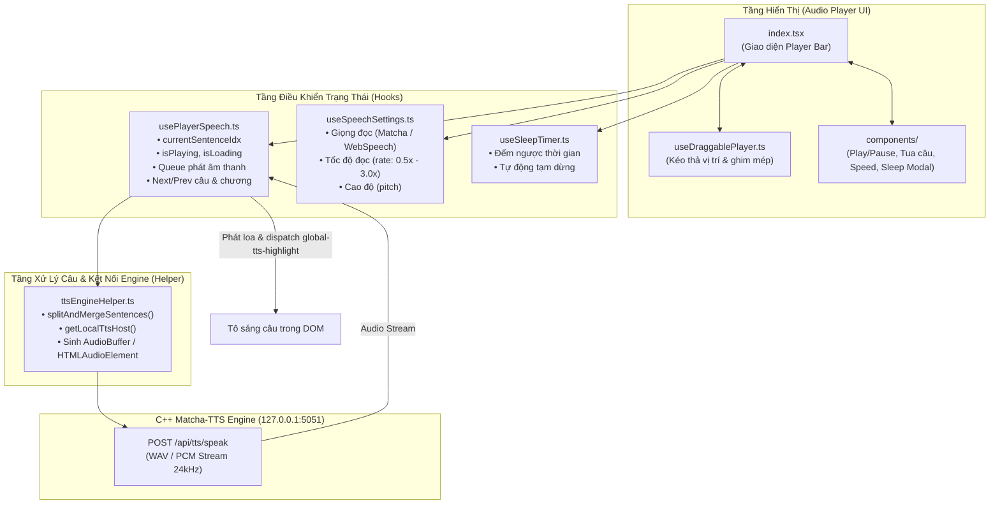
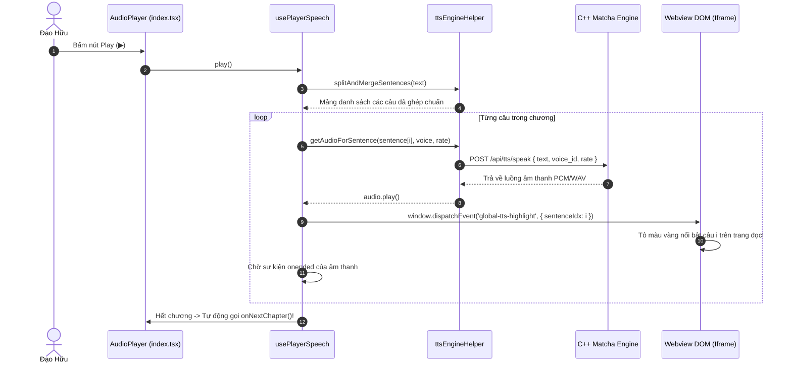

# 📁 Thanh Điều Khiển Trình Phát Sách Nói (Audio Player Bar)

> **Đường dẫn thư mục:** `frontend/src/components/audio/player`  
> **Kiến trúc:** Fractal Modular Clean Architecture (Tối đa 7 files/thư mục, $\le$ 300 dòng/file)  
> **Trách nhiệm cốt lõi:** Quản lý toàn bộ giao diện và luồng điều khiển âm thanh sách nói Text-to-Speech (TTS), hỗ trợ kéo thả tự do, hẹn giờ tắt, đồng bộ câu đang đọc và gọi engine C++ Matcha-TTS nội bộ.

---

## 📌 Tổng Quan Kiến Trúc Audio Player

Audio Player là thành phần trung tâm đem lại trải nghiệm nghe truyện audio cho người dùng:
1. **Giao diện đa trạng thái (Floating / Docked Bar):** Cho phép gắn cố định ở chân trang hoặc kéo thả tự do quanh màn hình điện thoại/desktop (`useDraggablePlayer.ts`).
2. **Bộ máy phát âm thanh nơ-ron Offline:** Kết nối trực tiếp daemon C++ Matcha-TTS nội bộ tại `http://127.0.0.1:5051/api/tts/speak` với độ trễ cực thấp (< 50ms), fallback tự động sang Web Speech API của trình duyệt nếu daemon chưa bật.
3. **Thuật toán tách câu & Đồng bộ điểm đọc (`splitAndMergeSentences`):** Phân tích văn bản tiếng Việt thành từng câu hoàn chỉnh theo dấu câu (`.`, `!`, `?`, `\n`), ghép các câu quá ngắn để tránh ngắt quãng giọng đọc và đồng bộ chính xác với chỉ số highlight trong DOM.
4. **Hẹn giờ tắt thông minh (Sleep Timer):** Tự động dừng phát sau 15, 30, 45, 60 phút hoặc sau khi đọc hết chương truyện hiện tại (`useSleepTimer.ts`).
5. **Mô hình Giọng Nơ-ron Đơn Chuẩn & Tốc độ Tinh Gọn:** Tối ưu hóa cho mô hình nơ-ron đơn giọng Matcha-TTS C++ INT8, loại bỏ các menu chọn giọng dư thừa và hỗ trợ tùy biến tốc độ đọc từ 0.5x đến 3.0x mượt mà (`useSpeechSettings.ts`).

---

## 📊 Sơ Đồ Kiến Trúc Luồng Âm Thanh & Điều Phối (Mermaid Flowchart)

---

## 🔄 Sơ Đồ Tuần Tự Phát Câu & Đồng Bộ Tô Sáng (Sequence Diagram)

---

## 📄 Chi Tiết Từng Tệp Tin Trong Thư Mục

| Tên Tệp Tin | Dòng Code | Vai Trò & Thuật Toán Trọng Tâm | Các Exports Chính |
| :--- | :---: | :--- | :--- |
| [`AudioPlayer.types.ts`](file:///home/alida/Documents/Extension_reader_tool/ttS/frontend/src/components/audio/player/AudioPlayer.types.ts) | 36 | Định nghĩa các cấu trúc kiểu dữ liệu: thông tin sách nói (`AudioPlayerBook`), props truyền vào (`AudioPlayerProps`) và tọa độ kéo thả (`PositionState`). | `AudioPlayerBook`, `AudioPlayerProps`, `PositionState` |
| [`index.tsx`](file:///home/alida/Documents/Extension_reader_tool/ttS/frontend/src/components/audio/player/index.tsx) | 213 | Component giao diện Player Bar chính. Ghép nối thanh điều khiển, hiển thị tên chương, nút Play/Pause, thời lượng còn lại và các modal tiện ích. | `AudioPlayer` |
| [`ttsEngineHelper.ts`](file:///home/alida/Documents/Extension_reader_tool/ttS/frontend/src/components/audio/player/ttsEngineHelper.ts) | 219 | Thuật toán tách câu thông minh (`splitAndMergeSentences`), quản lý Singleton `stopAllGlobalAudio`, điều phối phát âm thanh theo nền tảng (100% Local On-Device `127.0.0.1:5051` cho cả Mobile và Desktop), tải âm thanh tốc độ cao (~20-50ms). | `getLocalTtsHost`, `isSpeechSynthesisAvailable`, `logTrace`, `splitAndMergeSentences`, `stopAllGlobalAudio`, `cleanupAudioElement`, `findStartSentenceIndex` |
| [`useDraggablePlayer.ts`](file:///home/alida/Documents/Extension_reader_tool/ttS/frontend/src/components/audio/player/useDraggablePlayer.ts) | 132 | Hook xử lý cử chỉ kéo thả người dùng: tính toán tọa độ `clientX, clientY`, hạn chế rơi ra ngoài màn hình và tự động hít (snap) vào cạnh mép thiết bị. | `useDraggablePlayer` |
| [`usePlayerSpeech.ts`](file:///home/alida/Documents/Extension_reader_tool/ttS/frontend/src/components/audio/player/usePlayerSpeech.ts) | 295 | Quản lý máy trạng thái âm thanh: Play, Pause, Resume, Stop, tua câu kế/trước. Bảo vệ triệt để chống phát đè nhiều instance cùng lúc qua window singleton, debounce chuyển trạng thái, giải phóng URL blob tức thì khi chuyển câu/chuyển chương. | `usePlayerSpeech` |
| [`useSleepTimer.ts`](file:///home/alida/Documents/Extension_reader_tool/ttS/frontend/src/components/audio/player/useSleepTimer.ts) | 43 | Hook đếm ngược thời gian hẹn giờ ngủ: tự động giảm số giây còn lại và kích hoạt tạm dừng khi hết giờ. | `useSleepTimer` |
| [`useSpeechSettings.ts`](file:///home/alida/Documents/Extension_reader_tool/ttS/frontend/src/components/audio/player/useSpeechSettings.ts) | 78 | Quản lý các cấu hình giọng nói: tối ưu cho mô hình đơn giọng Matcha-TTS C++ INT8, tốc độ đọc (0.5x - 3.0x), âm lượng và lưu vào `localStorage`. | `useSpeechSettings` |

---

## 📂 Danh Sách Thư Mục Con

| Thư mục con | Mục đích chức năng |
| :--- | :--- |
| [`components/`](file:///home/alida/Documents/Extension_reader_tool/ttS/frontend/src/components/audio/player/components/README.md) | Chứa các UI con: `PlayerControls.tsx` (cụm nút Play/Pause/Tua), `PlayerProgress.tsx` (thanh tiến trình câu), `SpeedModal.tsx` (hộp thoại chọn tốc độ), `SleepTimerModal.tsx` (hộp thoại hẹn giờ). |

---

## ⚙️ Quy Chuẩn Kỹ Thuật

1. **Hiệu Suất Phát Thời Gian Thực:** Âm thanh câu kế tiếp được tiền nạp (preload) trước 1 câu, đảm bảo quá trình chuyển đổi giữa các câu đọc diễn ra liên tục 0ms không bị khựng giọng.
2. **Tiêu Chuẩn Âm Thanh Di Động:** Tuân thủ cấu hình `AVAudioSession` trên iOS và `ForegroundService` trên Android giúp phát sách nói ổn định ngay cả khi tắt màn hình.

---
*Tài liệu được cập nhật tự động đồng bộ theo hệ thống Tiên Hiệp AI Clean Architecture.*
