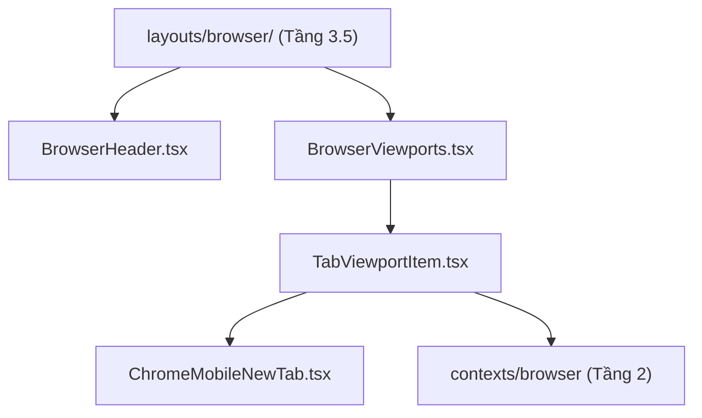

# 📁 components/browser

> **Đường dẫn thư mục:** `frontend/src/components/browser`  
> **Tầng kiến trúc:** Tầng 3 (Thành phần giao diện tái sử dụng — Reusable UI Components)  
> **Kiến trúc:** Fractal Modular Clean Architecture (Tối đa 7 files/thư mục, $\le$ 300 dòng/file)

## 📌 Tổng Quan & Mục Đích

Thư mục chứa các thành phần nguyên mẫu của hệ thống trình duyệt web nhúng đa tab: Thanh địa chỉ URL (`BrowserHeader`), Viewport hiển thị Iframe (`BrowserViewports`, `TabViewportItem`), và Trang tab mới (`ChromeMobileNewTab`).

## 📄 Chi Tiết Các Tệp Tin Trong Thư Mục

| Tên Tệp Tin | Dòng Code | Vai Trò & Trách Nhiệm Chính | Các Exports Chính |
| :--- | :---: | :--- | :--- |
| `BrowserHeader.tsx` | 298 | Thanh công cụ duyệt web: ô nhập URL, nút điều hướng, chuyển đổi desktop/mobile mode, nút công cụ nhanh có kiểm tra an toàn mảng pinnedTools. | `BrowserHeader` |
| `BrowserViewports.tsx` | 44 | Vùng hiển thị tập hợp các tab web đang mở. | `BrowserViewportsProps`, `BrowserViewports` |
| `TabViewportItem.tsx` | 299 | Khung Iframe độc lập cho từng tab, tiêm `injected_bundle.js` và xử lý kết nối HTTP offline. | `TabViewportItemProps`, `TabViewportItem` |
| `ChromeMobileNewTab.tsx` | 156 | Giao diện New Tab của trình duyệt với phím tắt nhanh, thanh tìm kiếm và chế độ Ẩn danh. | `ChromeMobileNewTab` |
| `index.ts` | 5 | Điểm xuất khẩu barrel module cho các thành phần viewport của browser. | Toàn bộ từ các tệp trên |

## 🔗 Luồng Phụ Thuộc (Single-Direction Tree)

