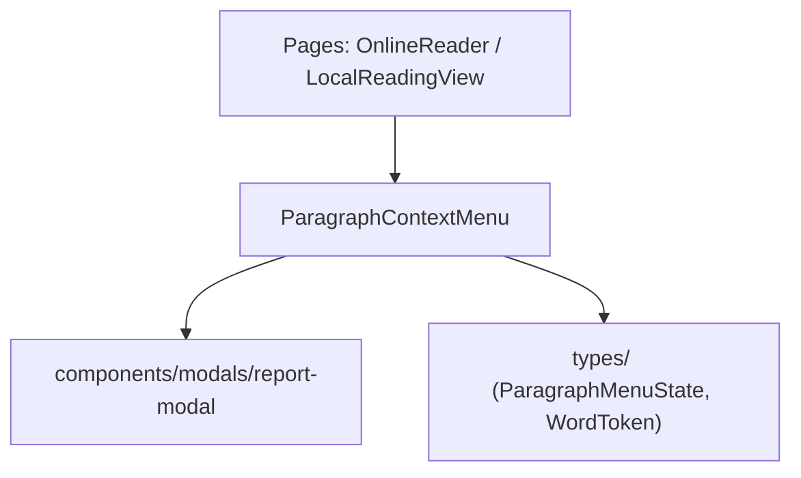

# 📁 components/reader/paragraph-menu

> **Tầng kiến trúc:** Tầng 3 (Thành phần giao diện dùng chung — Reusable Components)  
> **Chức năng:** Menu ngữ cảnh hiển thị dưới chân màn hình khi người dùng chọn đoạn văn trong trình đọc (Online & Local Reader).

## 📄 Danh Sách Tệp Mã Nguồn

| Tệp tin | Dòng | Vai trò & Trách nhiệm | Xuất bản (Exports) |
| :--- | :--- | :--- | :--- |
| `ParagraphContextMenu.tsx` | 272 | Thanh công cụ thao tác nhanh: chọn chế độ dịch, bóc tách cụm từ tiếng Trung, đổi nghĩa, báo lỗi và phát TTS từ đoạn được chọn. | `ParagraphContextMenu`, `ParagraphMenuState`, `WordToken` |
| `index.ts` | 1 | Điểm xuất khẩu barrel module. | Toàn bộ từ `ParagraphContextMenu` |

## 🔗 Luồng Phụ Thuộc (Dependency Tree)

