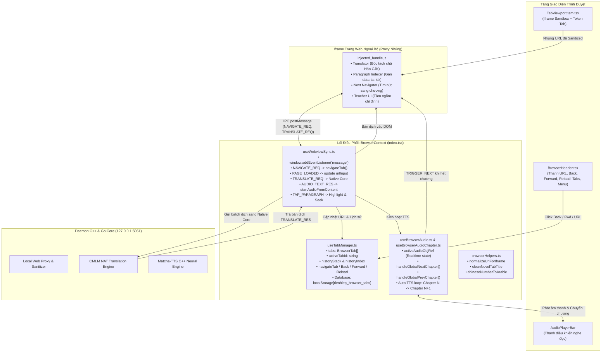
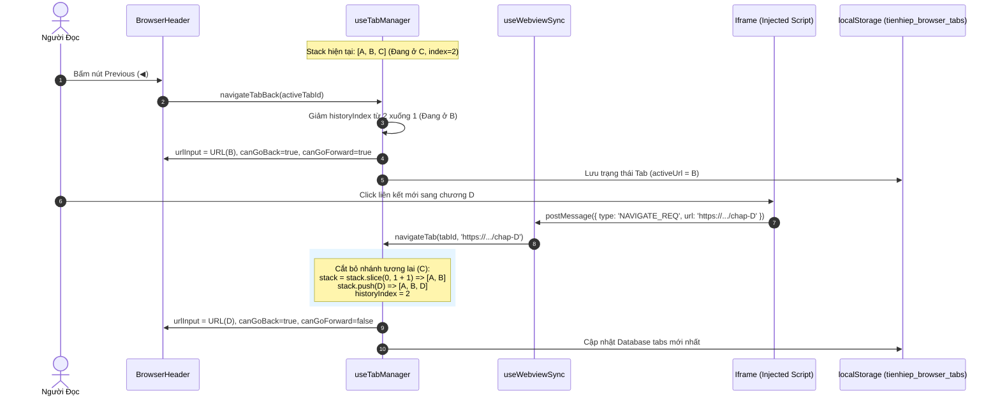
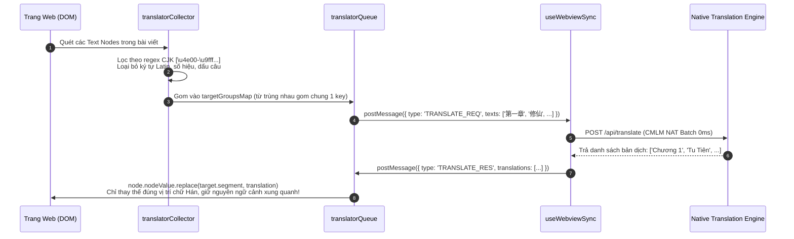
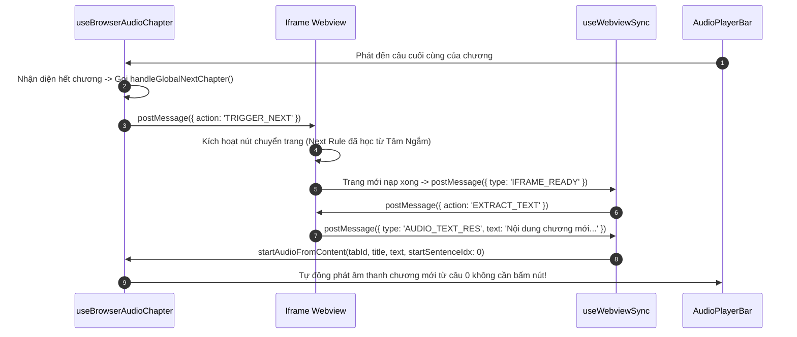

# 📁 Context Quản Lý Trình Duyệt Web Đa Tab (Browser Context)

> **Đường dẫn thư mục:** `frontend/src/contexts/browser`  
> **Kiến trúc:** Fractal Modular Clean Architecture (Tối đa 7 files/thư mục, $\le$ 300 dòng/file)  
> **Trách nhiệm cốt lõi:** Quản lý toàn bộ vòng đời trình duyệt web nhúng đa tab, giao tiếp IPC hai chiều với webview iframe, điều phối bộ máy âm thanh TTS và lưu trữ ngăn xếp lịch sử duyệt web theo chuẩn Chrome.

---

## 📌 Tổng Quan Kiến Trúc & Vai Trò Hệ Thống

`BrowserContext` là trung tâm điều phối phức tạp và quan trọng nhất trong tầng ứng dụng của Tiên Hiệp AI. Module này hợp nhất:
1. **Quản trị đa tab (Tab Manager):** Mở tab, đóng tab, nhân bản tab, dọn dẹp bộ nhớ và lưu trữ trạng thái vào cơ sở dữ liệu `localStorage` (`tienhiep_browser_tabs`).
2. **Cơ chế ngăn xếp lịch sử chuẩn duyệt web (Navigation Stack with Future Truncation):** Xử lý luồng `A -> B -> C`, lùi về `B`, điều hướng `D` $\rightarrow$ cắt bỏ `C` và tạo nhánh mới `[A, B, D]`.
3. **Kênh truyền thông IPC thời gian thực (Bidirectional IPC Bridge):** Nhận và phản hồi các thông điệp `postMessage` giữa ứng dụng mẹ và iframe tiêm kịch bản (`injected_bundle.js`).
4. **Hệ thống âm thanh & Tự động chuyển chương (Audio Coordinator):** Duy trì `activeAudioObjRef` thời gian thực, điều khiển phát giọng đọc C++ Matcha-TTS và tự động sang chương tiếp theo liền mạch khi đọc hết văn bản.

---

## 📊 Sơ Đồ Kiến Trúc Kết Nối Logic & Giao Tiếp Dữ Liệu (Mermaid Architecture)

---

## 🔄 Sơ Đồ Tuần Tự (Sequence Diagrams) Các Luồng Xử Lý Trọng Tâm

### 1. Luồng Điều Hướng & Cắt Nhánh Lịch Sử (`A -> B -> C`, Lùi về `B`, Mở `D` => `[A, B, D]`)

---

### 2. Luồng Bóc Tách Chữ Hán, Gom Trùng Lặp & Gắn Bản Dịch Chính Xác

---

### 3. Luồng Tự Động Chuyển Chương & Phát TTS Liền Mạch

---

## 📄 Chi Tiết Từng Tệp Tin Trong Thư Mục

| Tên Tệp Tin | Dòng Code | Vai Trò & Thuật Toán Trọng Tâm | Các Exports Chính |
| :--- | :---: | :--- | :--- |
| [`BrowserContext.types.ts`](file:///home/alida/Documents/Extension_reader_tool/ttS/frontend/src/contexts/browser/BrowserContext.types.ts) | 134 | Định nghĩa kiểu dữ liệu toàn diện cho hệ thống trình duyệt: cấu trúc tab (`BrowserTab`), item lịch sử (`HistoryItem`), dấu trang (`BookmarkItem`), sách nói đang phát (`ActiveAudioBook`), và interface hợp nhất (`BrowserContextValue`). | `BrowserTab`, `BookmarkItem`, `HistoryItem`, `ToastInfo`, `ActiveAudioBook`, `BrowserContextValue` |
| [`browserHelpers.ts`](file:///home/alida/Documents/Extension_reader_tool/ttS/frontend/src/contexts/browser/browserHelpers.ts) | 226 | Thuật toán chuyển đổi số Hán tự sang số Ả Rập (`chineseNumberToArabic`), làm sạch tiêu đề truyện (`cleanNovelTabTitle`), chuẩn hóa URL proxy cho iframe kèm `tabId`, tiêm script dịch (`injectTranslateScriptToTab`), xử lý dịch batch văn bản đa mode (`executeTranslate`, `ensureVietnameseText`). | `isCapacitor`, `getCachedTranslation`, `setCachedTranslation`, `chineseNumberToArabic`, `cleanNovelTabTitle`, `executeTranslate`, `ensureVietnameseText`, `normalizeUrlForIframe`, `injectTranslateScriptToTab` |
| [`index.tsx`](file:///home/alida/Documents/Extension_reader_tool/ttS/frontend/src/contexts/browser/index.tsx) | 201 | Điểm hợp nhất của toàn bộ Browser Context. Khởi tạo `BrowserContext`, cung cấp `BrowserProvider`, kết nối state từ `useTabManager`, `useWebviewSync` và `useBrowserAudio`, xuất hook chuẩn hóa `useBrowser()`. | `BrowserContext`, `useBrowser`, `BrowserProvider` |
| [`useBrowserAudio.ts`](file:///home/alida/Documents/Extension_reader_tool/ttS/frontend/src/contexts/browser/useBrowserAudio.ts) | 206 | Quản lý state phát TTS của trình duyệt: `activeAudioObj`, `setActiveAudioObj`, đồng bộ con trỏ `activeAudioObjRef` thời gian thực (tránh closure stale state). Cơ chế phân đoạn ưu tiên (priority streaming): dịch ngay các đoạn khởi đầu để phát TTS tức thì (< 50ms) và nạp ngầm các đoạn còn lại. | `useBrowserAudio` |
| [`useBrowserAudioChapter.ts`](file:///home/alida/Documents/Extension_reader_tool/ttS/frontend/src/contexts/browser/useBrowserAudioChapter.ts) | 233 | Điều phối chuyển chương tự động thông minh: hỗ trợ 3 chế độ đọc: `offline`, `online` và `webview`. Tự động tạm dừng âm thanh cũ ngay khi phát lệnh `TRIGGER_NEXT` để chống đè tiếng giữa các chương. | `useBrowserAudioChapter` |
| [`useTabManager.ts`](file:///home/alida/Documents/Extension_reader_tool/ttS/frontend/src/contexts/browser/useTabManager.ts) | 293 | Cơ sở dữ liệu và thuật toán quản trị tab: tạo mới, đóng tab, chuyển đổi tab, điều hướng URL với thuật toán cắt nhánh lịch sử tương lai (`slice(0, idx + 1)`), lưu trữ bền vững vào `localStorage[tienhiep_browser_tabs]`, quản lý bookmark & history. | `useTabManager` |
| [`useWebviewSync.ts`](file:///home/alida/Documents/Extension_reader_tool/ttS/frontend/src/contexts/browser/useWebviewSync.ts) | 300 | Cầu nối thông điệp IPC hai chiều: lắng nghe sự kiện `message`, xử lý `NAVIGATE_REQ`, `PAGE_LOADED`, `TRANSLATE_REQ`, `AUDIO_TEXT_RES`, `TAP_PARAGRAPH`. Cơ chế khử trùng lặp sự kiện kép chống phát nhiều luồng TTS đồng thời và chống tràn âm thanh khi đổi trang. | `useWebviewSync` |

---

## 📂 Liên Kết Tầng Kiến Trúc Liên Quan (Related Tree Modules)

Theo chuẩn **Quy Luật Kiến Trúc Cây Phân Cấp Đơn Chiều** (`docs/TREE_DEPENDENCY_ARCHITECTURE.md`), tầng State Context (Level 2) hoàn toàn độc lập với UI. Các thành phần giao diện trình duyệt được đặt tại các tầng tương ứng:

| Tầng Phân Cấp | Thư mục liên quan | Vai trò & Thành phần |
| :--- | :--- | :--- |
| **Level 3 (UI Components)** | [`frontend/src/components/browser/`](file:///home/alida/Documents/Extension_reader_tool/ttS/frontend/src/components/browser/README.md) | Chứa các thành phần UI nguyên tử: `BrowserHeader.tsx` (thanh URL, các nút điều hướng), `BrowserViewports.tsx` (khung nhìn webview), `TabViewportItem.tsx` (sandbox iframe), `ChromeMobileNewTab.tsx` (trang tab mới). |
| **Level 3.5 (Layout Shells)** | [`frontend/src/layouts/browser/`](file:///home/alida/Documents/Extension_reader_tool/ttS/frontend/src/layouts/browser/README.md) | Vỏ bọc toàn màn hình điều phối: `BrowserOverlay.tsx` (kết nối state từ `useBrowser()` tới Header, Viewport, QuickTools và Modals). |

---

## ⚙️ Quy Chuẩn Kiến Trúc & An Toàn Mã Nguồn

1. **Fractal Boundary & Phân Tách Trách Nhiệm:** Thư mục duy trì chính xác 7 file mã nguồn cốt lõi (đạt chuẩn tối đa $\le 7$ files/thư mục). Tầng Context chỉ quản lý logic trạng thái, không chứa mã JSX trình bày UI.
2. **Line Budget Control:** Toàn bộ 7 file đều $\le 300$ dòng mã nguồn (từ 133 đến 299 dòng), đảm bảo khả năng tối ưu hóa bộ nhớ đệm context và kiểm thử độc lập.
3. **IPC Isolation:** Toàn bộ giao tiếp giữa ứng dụng chính và trang web ngoại vi đều thông qua IPC an toàn có chỉ định `origin` và kiểm tra payload, ngăn ngừa tuyệt đối nguy cơ rò rỉ bảo mật XSS.

---
*Tài liệu được cập nhật tự động đồng bộ theo hệ thống Tiên Hiệp AI Clean Architecture.*
