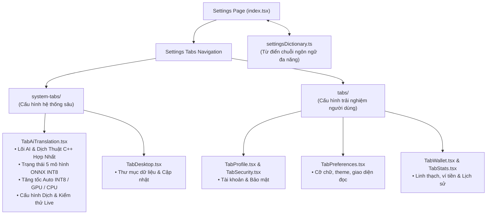

# 📁 Trang Cài Đặt Ứng Dụng (App Settings)

> **Đường dẫn thư mục:** `frontend/src/pages/portal/settings`  
> **Kiến trúc:** Fractal Modular Clean Architecture (Tối đa 7 files/thư mục, $\le$ 300 dòng/file)  
> **Trách nhiệm cốt lõi:** Trung tâm cấu hình toàn diện của ứng dụng: quản lý các tùy chọn hiển thị đọc truyện, thiết lập bộ máy dịch AI Translation, tinh chỉnh giọng đọc C++ Matcha-TTS nội bộ, cấu hình mạng và lưu trữ dữ liệu.

---

## 📌 Tổng Quan Trung Tâm Cài Đặt

Trang Cài đặt được tổ chức theo kiến trúc phân tách tab chuyên biệt:
1. **Thiết lập giao diện đọc sách (Reader Aesthetics):** Điều chỉnh cỡ chữ, phông chữ (Inter, Literata, Roboto), chiều cao dòng, khoảng cách đoạn và 6 bộ chủ đề màu sắc (Sáng, Tối, Vàng Giấy Cũ, Xanh Dịu Mắt, Huyền Vũ, Tiên Cảnh).
2. **Lõi AI & Dịch Thuật C++ Hợp Nhất (Native Core AI & Translation):** Trung tâm hợp nhất quản lý cả cỗ máy dịch thuật CMLM NAT INT8 (~3ms), 5 mô hình nơ-ron On-Device, chọn chip xử lý Auto/GPU/CPU, tùy biến chế độ dịch (Mode 1-4, Vietphrase, Hán Việt, Raw) và trạm kiểm thử âm thanh giọng đọc Matcha-TTS trực tiếp.
3. **Cấu hình Môi Trường Ứng Dụng (Desktop/Mobile):** Quản trị đường dẫn lưu trữ, kiểm tra cập nhật phiên bản.
4. **Đa ngôn ngữ & Từ điển giao diện (`settingsDictionary.ts`):** Hỗ trợ chuyển đổi nhanh giao diện sang Tiếng Việt, Tiếng Anh, Tiếng Trung.

---

## 📊 Sơ Đồ Kiến Trúc Phân Tách Tab Cài Đặt (Mermaid Flowchart)

---

## 📄 Chi Tiết Từng Tệp Tin Trong Thư Mục

| Tên Tệp Tin | Dòng Code | Vai Trò & Thuật Toán Trọng Tâm | Các Exports Chính |
| :--- | :---: | :--- | :--- |
| [`Settings.types.ts`](file:///home/alida/Documents/Extension_reader_tool/ttS/frontend/src/pages/portal/settings/Settings.types.ts) | 28 | Định nghĩa các kiểu dữ liệu cho cài đặt: trạng thái cấu hình dịch (`TranslationSettings`), danh sách id tab (`SettingsTabId`) và cấu trúc item tab (`TabItem`). | `TranslationSettings`, `SettingsTabId`, `TabItem` |
| [`index.tsx`](file:///home/alida/Documents/Extension_reader_tool/ttS/frontend/src/pages/portal/settings/index.tsx) | 275 | Component màn hình Cài đặt chính: thanh tiêu đề, menu danh mục tab trượt ngang trên mobile, hiển thị nội dung tab tương ứng và cơ chế tự động lưu cấu hình. | `Settings` |
| [`settingsDictionary.ts`](file:///home/alida/Documents/Extension_reader_tool/ttS/frontend/src/pages/portal/settings/settingsDictionary.ts) | 234 | Từ điển đa ngôn ngữ chuyên biệt cho trang cài đặt: chứa các bản dịch nhãn, thông báo gợi ý và mô tả tính năng cho cả 3 ngôn ngữ vi, en, zh. | `settingsDictionary` |

---

## 📂 Danh Sách Thư Mục Con

| Thư mục con | Mục đích chức năng |
| :--- | :--- |
| [`components/`](file:///home/alida/Documents/Extension_reader_tool/ttS/frontend/src/pages/portal/settings/components/README.md) | Các UI components con: thanh chọn tab `SettingsTabBar.tsx`, hàng công tắc `SettingsToggle.tsx`. |
| [`system-tabs/`](file:///home/alida/Documents/Extension_reader_tool/ttS/frontend/src/pages/portal/settings/system-tabs/README.md) | Các tab chuyên sâu hệ thống: cấu hình AI Translation, cấu hình TTS C++ Daemon. |
| [`tabs/`](file:///home/alida/Documents/Extension_reader_tool/ttS/frontend/src/pages/portal/settings/tabs/README.md) | Các tab cấu hình người dùng: hiển thị đọc sách, quản lý lưu trữ offline, tài khoản. |

---
*Tài liệu được cập nhật tự động đồng bộ theo hệ thống Tiên Hiệp AI Clean Architecture.*
