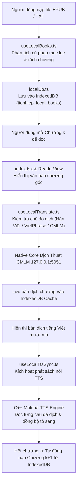

# 📁 Trình Đọc Truyện Offline (Local Reader)

> **Đường dẫn thư mục:** `frontend/src/pages/reader/local-reader`  
> **Kiến trúc:** Fractal Modular Clean Architecture (Tối đa 7 files/thư mục, $\le$ 300 dòng/file)  
> **Trách nhiệm cốt lõi:** Quản lý toàn bộ trải nghiệm đọc và nghe sách ngoại tuyến (Offline Reading Engine) từ các tệp EPUB và TXT, lưu trữ bền vững trong cơ sở dữ liệu IndexedDB, dịch thuật lũy tiến (Progressive Translation) và đồng bộ âm thanh TTS.

---

## 📌 Tổng Quan Kiến Trúc Local Reader

Local Reader cho phép người dùng nhập sách từ máy tính hoặc điện thoại mà không cần kết nối Internet:
1. **Phân tích cú pháp tệp EPUB / TXT:** Tự động nhận diện cấu trúc chương theo các quy tắc biểu thức chính quy tiếng Việt và tiếng Trung (`Chương \d+`, `第.+章`).
2. **Cơ sở dữ liệu IndexedDB nội bộ (`localDb.ts`):** Lưu trữ toàn bộ nội dung sách, mục lục chương, tiến độ đọc (`lastReadChapterIdx`) và đánh dấu trang ngay trong trình duyệt mà không làm đầy bộ nhớ RAM.
3. **Dịch thuật lũy tiến (Progressive Translation - `useLocalTranslate.ts`):** Hỗ trợ dịch chương tức thì theo 3 chế độ: Hán Việt, VietPhrase hoặc AI Nơ-ron CMLM NAT. Quá trình dịch diễn ra trong nền (background) theo từng đoạn để người dùng có thể đọc ngay lập tức mà không phải chờ đợi toàn bộ chương.
4. **Đồng bộ âm thanh TTS ngoại tuyến (`useLocalTtsSync.ts`):** Kết nối trực tiếp với thanh Audio Player để đọc nội dung chương đã dịch, tự động lật chương khi đọc xong.

---

## 📊 Sơ Đồ Kiến Trúc Luồng Đọc Truyện Offline (Mermaid Flowchart)

---

## 📄 Chi Tiết Từng Tệp Tin Trong Thư Mục

| Tên Tệp Tin | Dòng Code | Vai Trò & Thuật Toán Trọng Tâm | Các Exports Chính |
| :--- | :---: | :--- | :--- |
| [`LocalReader.types.ts`](file:///home/alida/Documents/Extension_reader_tool/ttS/frontend/src/pages/reader/local-reader/LocalReader.types.ts) | 24 | Định nghĩa cấu trúc dữ liệu cho sách offline: chương truyện (`LocalChapter`), đối tượng sách (`LocalBook`) và thông tin lưu trữ (`StorageInfo`). | `LocalChapter`, `LocalBook`, `StorageInfo` |
| [`index.tsx`](file:///home/alida/Documents/Extension_reader_tool/ttS/frontend/src/pages/reader/local-reader/index.tsx) | 178 | Component giao diện màn hình đọc offline chính: tích hợp thanh công cụ điều hướng chương, menu cài đặt hiển thị (cỡ chữ, màu nền), mục lục sách và liên kết với Audio Player. | `LocalReader` |
| [`localDb.ts`](file:///home/alida/Documents/Extension_reader_tool/ttS/frontend/src/pages/reader/local-reader/localDb.ts) | 77 | Tầng DAO (Data Access Object) quản lý cơ sở dữ liệu IndexedDB: khởi tạo database `tienhiep_local_db`, lưu sách, lấy danh sách sách, cập nhật tiến độ đọc và xóa sách. | `getIndexedDB`, `getLocalBooksFromDB`, `saveLocalBookToDB`, `deleteLocalBookFromDB` |
| [`useLocalBooks.ts`](file:///home/alida/Documents/Extension_reader_tool/ttS/frontend/src/pages/reader/local-reader/useLocalBooks.ts) | 146 | Quản lý danh sách sách ngoại tuyến: xử lý sự kiện import file từ input, phân tích file txt/epub, cập nhật state sách đang mở và chuyển đổi qua lại giữa các chương. | `useLocalBooks` |
| [`useLocalTranslate.ts`](file:///home/alida/Documents/Extension_reader_tool/ttS/frontend/src/pages/reader/local-reader/useLocalTranslate.ts) | 185 | Điều phối dịch thuật lũy tiến (Progressive Translation): tự động phát hiện văn bản tiếng Trung, chia đoạn gửi sang bộ dịch, lưu cache bản dịch và cập nhật văn bản hiển thị theo thời gian thực. | `TranslateMode`, `useLocalTranslate` |
| [`useLocalTtsSync.ts`](file:///home/alida/Documents/Extension_reader_tool/ttS/frontend/src/pages/reader/local-reader/useLocalTtsSync.ts) | 178 | Đồng bộ trạng thái âm thanh: tạo đối tượng `ActiveAudioBook` từ chương offline, kích hoạt phát giọng đọc Matcha-TTS, lắng nghe sự kiện đổi câu và bắt lệnh chuyển chương tiếp theo. | `useLocalTtsSync` |

---

## 📂 Danh Sách Thư Mục Con

| Thư mục con | Mục đích chức năng |
| :--- | :--- |
| [`components/`](file:///home/alida/Documents/Extension_reader_tool/ttS/frontend/src/pages/reader/local-reader/components/README.md) | Chứa các UI components: `LocalReaderHeader.tsx`, `LocalReaderToc.tsx` (mục lục chương), `LocalReaderSettings.tsx` (tùy biến giao diện) và thư mục con `reader-view/`. |

---

## ⚙️ Quy Chuẩn Lưu Trữ Ngoại Tuyến

1. **IndexedDB Persisted Storage:** Dữ liệu sách được lưu trực tiếp vào ổ nhớ nội bộ của trình duyệt/thiết bị, không bị mất đi khi người dùng reload trang hoặc khởi động lại ứng dụng.
2. **Chunked Rendering:** Đối với các tệp sách TXT dung lượng lớn (> 50MB), thuật toán chia nhỏ thành từng chương độc lập giúp tránh hiện tượng tràn bộ nhớ heap trên điện thoại di động.

---
*Tài liệu được cập nhật tự động đồng bộ theo hệ thống Tiên Hiệp AI Clean Architecture.*
