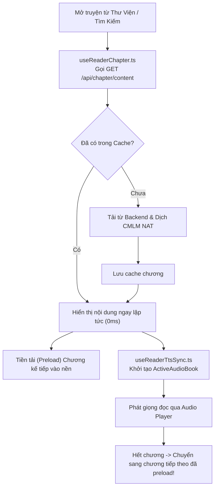

# 📁 Trình Đọc Truyện Trực Tuyến (Online Reader)

> **Đường dẫn thư mục:** `frontend/src/pages/reader/online-reader`  
> **Kiến trúc:** Fractal Modular Clean Architecture (Tối đa 7 files/thư mục, $\le$ 300 dòng/file)  
> **Trách nhiệm cốt lõi:** Quản lý giao diện đọc tiểu thuyết trực tuyến theo cấu trúc chương được phân tích từ backend, hỗ trợ đổi nguồn truyện (multi-source), theo dõi thời gian đọc, dịch thuật nơ-ron và đồng bộ âm thanh TTS.

---

## 📌 Tổng Quan Kiến Trúc Online Reader

Online Reader dành riêng cho các bộ truyện trực tuyến đã được hệ thống backend lưu trữ hoặc cào dữ liệu:
1. **Quản lý danh sách chương & Nguồn truyện (`useReaderChapter.ts`):** Tải nội dung chương từ API `/api/chapter/content`, tiền tải chương tiếp theo vào bộ nhớ đệm để chuyển trang 0ms và hỗ trợ chuyển đổi linh hoạt giữa nhiều nguồn truyện khác nhau (`SourceItem`).
2. **Đồng bộ thời gian thực với Audio Player (`useReaderTtsSync.ts`):** Tạo đối tượng `ActiveAudioBook` trực tuyến, điều khiển phát giọng đọc nơ-ron và tự động sang chương tiếp theo khi người dùng nghe hết.
3. **Thống kê thời gian tu luyện:** Ghi nhận số phút đọc truyện thực tế (`ReadingTimeInfo`) và lưu trữ vào lịch sử cá nhân trên hệ thống.

---

## 📊 Sơ Đồ Kiến Trúc Luồng Đọc Online (Mermaid Flowchart)

---

## 📄 Chi Tiết Từng Tệp Tin Trong Thư Mục

| Tên Tệp Tin | Dòng Code | Vai Trò & Thuật Toán Trọng Tâm | Các Exports Chính |
| :--- | :---: | :--- | :--- |
| [`Reader.types.ts`](file:///home/alida/Documents/Extension_reader_tool/ttS/frontend/src/pages/reader/online-reader/Reader.types.ts) | 25 | Định nghĩa kiểu dữ liệu cho giao diện đọc trực tuyến: đối tượng chương (`ChapterItem`), nguồn truyện (`SourceItem`), trạng thái tìm kiếm (`SearchMenuState`) và thời gian đọc (`ReadingTimeInfo`). | `ChapterItem`, `SourceItem`, `SearchMenuState`, `ReadingTimeInfo` |
| [`index.tsx`](file:///home/alida/Documents/Extension_reader_tool/ttS/frontend/src/pages/reader/online-reader/index.tsx) | 297 | Component màn hình đọc truyện trực tuyến: thanh menu đầu trang, khung hiển thị văn bản, bộ điều hướng chương trước/sau, thanh tiến trình đọc và chân trang. | `Reader` |
| [`useReaderChapter.ts`](file:///home/alida/Documents/Extension_reader_tool/ttS/frontend/src/pages/reader/online-reader/useReaderChapter.ts) | 215 | Hook quản lý vòng đời chương truyện: tải nội dung, xử lý lỗi mất mạng, chuyển đổi nguồn, ghi nhớ vị trí cuộn trang và tiền tải chương kế tiếp. | `useReaderChapter` |
| [`useReaderTtsSync.ts`](file:///home/alida/Documents/Extension_reader_tool/ttS/frontend/src/pages/reader/online-reader/useReaderTtsSync.ts) | 158 | Hook đồng bộ với Audio Player: trích xuất mảng câu từ văn bản chương, phát sự kiện âm thanh toàn cục và xử lý chuyển chương khi nghe xong. | `useReaderTtsSync` |

---

## 📂 Danh Sách Thư Mục Con

| Thư mục con | Mục đích chức năng |
| :--- | :--- |
| [`components/`](file:///home/alida/Documents/Extension_reader_tool/ttS/frontend/src/pages/reader/online-reader/components/README.md) | Chứa các thành phần UI: `ReaderHeader.tsx`, `ReaderFooter.tsx`, `ReaderSettingsModal.tsx`, `ReaderSourcesModal.tsx` (chọn nguồn truyện). |

---
*Tài liệu được cập nhật tự động đồng bộ theo hệ thống Tiên Hiệp AI Clean Architecture.*
