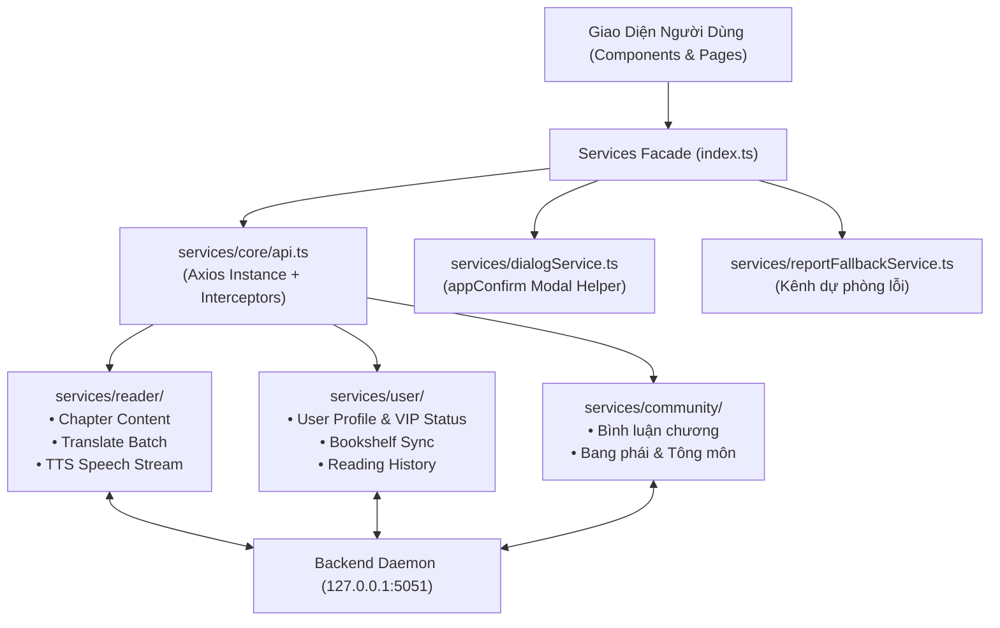

# 📁 Tầng Dịch Vụ API & Tương Tác Dữ Liệu (Services Layer)

> **Đường dẫn thư mục:** `frontend/src/services`  
> **Kiến trúc:** Fractal Modular Clean Architecture (Tối đa 7 files/thư mục, $\le$ 300 dòng/file)  
> **Trách nhiệm cốt lõi:** Cung cấp tầng Client API thống nhất, đóng gói các lời gọi HTTP/WebSocket đến backend, cấu hình Interceptors đính kèm Token xác thực, xử lý lỗi mất mạng và cơ chế Fallback tự động.

---

## 📌 Tổng Quan Kiến Trúc Tầng Dịch Vụ

Tầng `services` là ranh giới giao tiếp duy nhất giữa giao diện React và hệ thống Backend:
1. **HTTP Client cơ sở (`core/api.ts`):** Khởi tạo instance Axios có cấu hình Base URL động (tự động nhận diện `127.0.0.1:5051` trên desktop/mobile hoặc origin hiện tại trên web), timeout mặc định và tự động làm mới token.
2. **Dịch vụ đọc truyện & dịch thuật (`reader/`):** Tải nội dung chương, batch dịch thuật CMLM NAT và gửi yêu cầu tổng hợp âm thanh Matcha-TTS.
3. **Dịch vụ người dùng & Tủ sách (`user/`):** Đồng bộ tiến độ đọc, quản lý tủ sách cá nhân và thông tin gói thành viên VIP.
4. **Dịch vụ hộp thoại toàn cục (`dialogService.ts`):** Cung cấp hàm `appConfirm()` thay thế hoàn toàn `window.confirm()` mặc định bằng modal UI đẹp mắt chuẩn phong cách Tu Tiên.
5. **Cơ chế Fallback gửi báo cáo lỗi (`reportFallbackService.ts`):** Khi máy chủ chính gặp sự cố, hệ thống tự động chuyển hướng gửi phản hồi lỗi qua kênh dự phòng để không làm gián đoạn trải nghiệm người dùng.

---

## 📊 Sơ Đồ Kiến Trúc Tầng Dịch Vụ (Mermaid Flowchart)

---

## 📄 Chi Tiết Từng Tệp Tin Trong Thư Mục

| Tên Tệp Tin | Dòng Code | Vai Trò & Thuật Toán Trọng Tâm | Các Exports Chính |
| :--- | :---: | :--- | :--- |
| [`index.ts`](file:///home/alida/Documents/Extension_reader_tool/ttS/frontend/src/services/index.ts) | 22 | Tệp Facade xuất bản client API mặc định (`api`) phục vụ cho toàn bộ ứng dụng import tiện lợi. | `api` *(default export)* |
| [`dialogService.ts`](file:///home/alida/Documents/Extension_reader_tool/ttS/frontend/src/services/dialogService.ts) | 61 | Dịch vụ hộp thoại xác nhận toàn cục: cung cấp hàm `appConfirm(options)` trả về Promise `<boolean>`, liên kết với `ConfirmModal` trong DOM. | `ConfirmOptions`, `ConfirmState`, `registerDialogListener`, `appConfirm` |
| [`reportFallbackService.ts`](file:///home/alida/Documents/Extension_reader_tool/ttS/frontend/src/services/reportFallbackService.ts) | 95 | Xử lý gửi báo cáo lỗi với cơ chế đảo chiều thông minh qua api client và kênh serverless dự phòng. | `ReportData`, `ReportResult`, `submitReportWithFallback` |

---

## 📂 Danh Sách Thư Mục Con

| Thư mục con | Mục đích chức năng |
| :--- | :--- |
| [`core/`](file:///home/alida/Documents/Extension_reader_tool/ttS/frontend/src/services/core/README.md) | Client HTTP cơ sở, cấu hình Axios Interceptors và bộ xử lý lỗi mạng tập trung. |
| [`reader/`](file:///home/alida/Documents/Extension_reader_tool/ttS/frontend/src/services/reader/README.md) | Dịch vụ đọc truyện: lấy nội dung chương, dịch thuật CMLM và tổng hợp giọng nói TTS. |
| [`user/`](file:///home/alida/Documents/Extension_reader_tool/ttS/frontend/src/services/user/README.md) | Dịch vụ người dùng: quản lý tủ sách cá nhân, lịch sử đọc và quyền hạn thành viên VIP. |
| [`community/`](file:///home/alida/Documents/Extension_reader_tool/ttS/frontend/src/services/community/README.md) | Dịch vụ cộng đồng: gửi bình luận, tương tác bang phái và hoạt động đạo hữu. |

---
*Tài liệu được cập nhật tự động đồng bộ theo hệ thống Tiên Hiệp AI Clean Architecture.*
