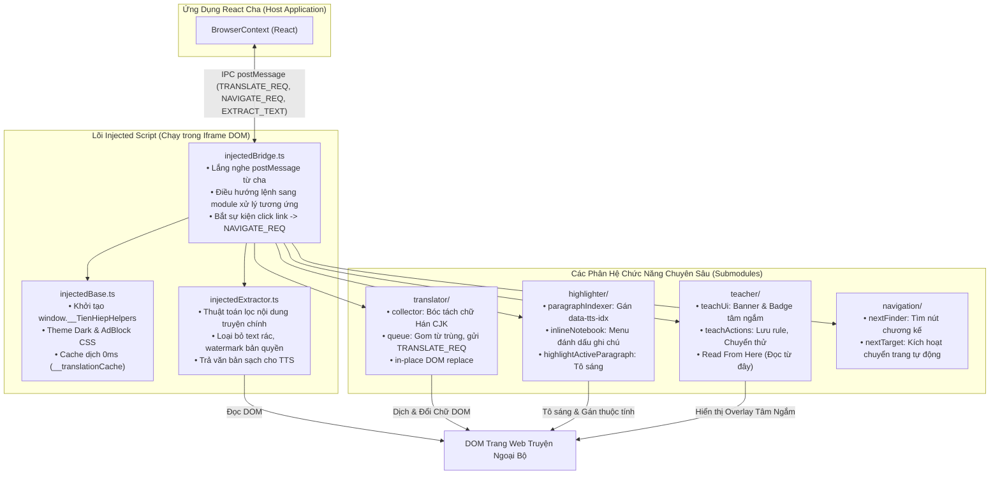

# 📁 Kịch Bản Tiêm Vào Webview Đọc Truyện (Injected Scripts)

> **Đường dẫn thư mục:** `frontend/src/utils/webview-injected`  
> **Kiến trúc:** Fractal Modular Clean Architecture (Tối đa 7 files/thư mục, $\le$ 300 dòng/file)  
> **Đầu ra biên dịch:** Được đóng gói thành `frontend/public/injected_bundle.js` và `native-core/web_reader/injected_bundle.js` để tiêm trực tiếp vào các trang web tiểu thuyết.

---

## 📌 Tổng Quan Kiến Trúc Kịch Bản Nhúng

`webview-injected` là tập hợp các module JavaScript chạy trực tiếp bên trong ngữ cảnh DOM của trang web ngoại bộ (được nạp thông qua Iframe Proxy). Bộ kịch bản này biến bất kỳ trang web đọc truyện Trung Quốc thông thường nào thành một trải nghiệm đọc truyện hiện đại:
1. **Chặn quảng cáo & Dark Mode:** Dọn sạch banner rác, pop-up khó chịu và đồng bộ theme tối bảo vệ mắt.
2. **Đánh số đoạn văn bản (Paragraph Indexing):** Tự động phân tích các thẻ `
`, gán chỉ số `data-tts-idx` để hỗ trợ tính năng chỉ định đọc và tô sáng câu realtime.
3. **Thuật toán bóc tách chữ Hán CJK:** Nhận diện và trích xuất riêng biệt các cụm chữ Hán `[\u4e00-\u9fff...]`, gom cụm từ trùng nhau để dịch tối ưu và thay thế chuẩn xác vào vị trí cũ.
4. **Tâm ngắm thông minh (Teach Mode UI):** Cho phép người dùng chạm chỉ định nút chuyển chương hoặc chạm vào đoạn văn để kích hoạt "📖 Đọc từ đây".
5. **Cầu nối IPC Bridge hai chiều:** Trao đổi dữ liệu với ứng dụng React cha thông qua chuẩn `window.postMessage`.

---

## 📊 Sơ Đồ Kiến Trúc & Luồng Điều Phối Trong Trang Web (Injected Pipeline)

---

## 📄 Chi Tiết Từng Tệp Tin Trong Thư Mục

| Tên Tệp Tin | Dòng Code | Vai Trò & Thuật Toán Trọng Tâm | Các Exports Chính |
| :--- | :---: | :--- | :--- |
| [`index.ts`](file:///home/alida/Documents/Extension_reader_tool/ttS/frontend/src/utils/webview-injected/index.ts) | 33 | Tập hợp và ghép nối tất cả các module con thành một hàm tạo script hoàn chỉnh (`createTranslateScript`) phục vụ cho tiến trình build bundle. | `createTranslateScript` |
| [`injectedAdBlockDark.ts`](file:///home/alida/Documents/Extension_reader_tool/ttS/frontend/src/utils/webview-injected/injectedAdBlockDark.ts) | 10 | Chèn mã CSS tinh gọn loại bỏ các phần tử quảng cáo (`.ads`, `iframe[src*="ad"]`, `.banner`) và thiết lập màu nền tối thư thái khi đọc đêm. | `getInjectedAdBlockDarkScript` |
| [`injectedBase.ts`](file:///home/alida/Documents/Extension_reader_tool/ttS/frontend/src/utils/webview-injected/injectedBase.ts) | 122 | Khởi tạo môi trường runtime: định nghĩa namespace toàn cục `window.__TienHiepHelpers`, bộ nhớ đệm dịch thuật tức thì `__translationCache` và hàm kiểm tra trạng thái trang web. | `getInjectedBaseScript` |
| [`injectedBridge.ts`](file:///home/alida/Documents/Extension_reader_tool/ttS/frontend/src/utils/webview-injected/injectedBridge.ts) | 225 | Kênh IPC nhận thông điệp từ cửa sổ cha: tiếp nhận các action `EXEC_HELPER`, `TOGGLE_AUTO_TRANSLATE`, `EXTRACT_TEXT`, `TRIGGER_NEXT`, `ENTER_TEACH_NEXT_MODE`; đồng thời chặn click liên kết để phát `NAVIGATE_REQ` lên cha. | `getInjectedBridgeScript` |
| [`injectedExtractor.ts`](file:///home/alida/Documents/Extension_reader_tool/ttS/frontend/src/utils/webview-injected/injectedExtractor.ts) | 268 | Thuật toán heuristic trích xuất văn bản chương: phân tích mật độ đoạn văn, nhận diện tiêu đề chương (`h1, h2, .title, #title`), loại bỏ liên kết điều hướng và xuất chuỗi văn bản sạch để gửi cho trình đọc TTS. | `getInjectedExtractorScript` |
| [`injectedHighlighter.ts`](file:///home/alida/Documents/Extension_reader_tool/ttS/frontend/src/utils/webview-injected/injectedHighlighter.ts) | 13 | Wrapper tích hợp logic từ module con `highlighter/` vào bundle tổng thể. | `getInjectedHighlighterScript` |
| [`injectedTranslator.ts`](file:///home/alida/Documents/Extension_reader_tool/ttS/frontend/src/utils/webview-injected/injectedTranslator.ts) | 14 | Wrapper tích hợp logic từ module con `translator/` vào bundle tổng thể. | `getInjectedTranslatorScript` |

---

## 📂 Danh Sách Thư Mục Con Chuyên Biệt (Submodules)

| Thư mục con | Mục đích chức năng |
| :--- | :--- |
| [`highlighter/`](file:///home/alida/Documents/Extension_reader_tool/ttS/frontend/src/utils/webview-injected/highlighter/README.md) | Quản lý đánh số đoạn văn (`paragraphIndexer.ts`), tô sáng câu đang đọc và menu ghi chú từ vựng (`inlineNotebook.ts`). |
| [`navigation/`](file:///home/alida/Documents/Extension_reader_tool/ttS/frontend/src/utils/webview-injected/navigation/README.md) | Tự động phân tích DOM để tìm liên kết sang chương kế tiếp (`nextFinder.ts`) và kích hoạt chuyển trang (`nextTarget.ts`). |
| [`teacher/`](file:///home/alida/Documents/Extension_reader_tool/ttS/frontend/src/utils/webview-injected/teacher/README.md) | Giao diện tâm ngắm người dùng: chọn nút chuyển chương, hỗ trợ thao tác chạm nhạy (`pointerdown, touchstart, click`) và tính năng "📖 Đọc từ đây". |
| [`translator/`](file:///home/alida/Documents/Extension_reader_tool/ttS/frontend/src/utils/webview-injected/translator/README.md) | Thuật toán bóc tách CJK, gom trùng lặp 96% request, gửi IPC dịch và thay thế chính xác vị trí trong DOM. |

---

## ⚙️ Quy Chuẩn Biên Dịch & Đóng Gói (Build Pipeline)

Mỗi khi có thay đổi trong các file TypeScript thuộc thư mục này, script build bundle tự động [`scripts/build_injected_bundle.js`](file:///home/alida/Documents/Extension_reader_tool/ttS/scripts/build_injected_bundle.js) sẽ:
1. Ghép nối các module theo đúng thứ tự phụ thuộc.
2. Xuất bản đồng bộ ra 2 vị trí runtime:
   - [`frontend/public/injected_bundle.js`](file:///home/alida/Documents/Extension_reader_tool/ttS/frontend/public/injected_bundle.js) (dành cho Web & Mobile Capacitor)
   - [`native-core/web_reader/injected_bundle.js`](file:///home/alida/Documents/Extension_reader_tool/ttS/native-core/web_reader/injected_bundle.js) (dành cho Local Proxy daemon)

---
*Tài liệu được cập nhật tự động đồng bộ theo hệ thống Tiên Hiệp AI Clean Architecture.*
