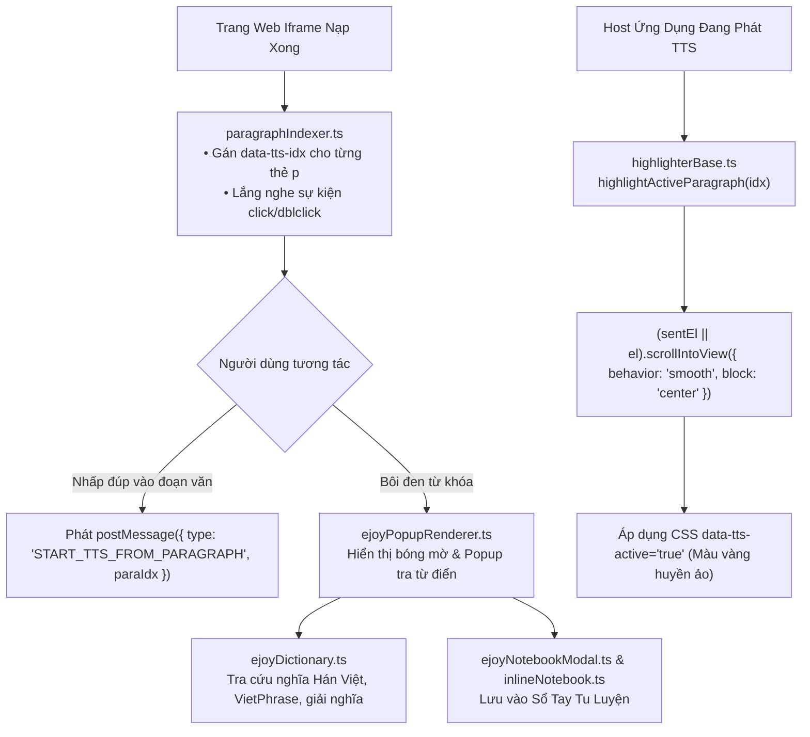

# 📁 Bộ Đánh Số & Tô Sáng Đoạn Văn (Highlighter & Paragraph Indexer)

> **Đường dẫn thư mục:** `frontend/src/utils/webview-injected/highlighter`  
> **Kiến trúc:** Fractal Modular Clean Architecture (Tối đa 7 files/thư mục, $\le$ 300 dòng/file)  
> **Trách nhiệm cốt lõi:** Quản lý chỉ số đoạn văn (`data-tts-idx`), phân tách và tô sáng câu đang đọc TTS trong DOM, tích hợp popup tra từ điển nhanh (eJoy Dictionary) và sổ tay ghi chú từ vựng (Inline Notebook).

---

## 📌 Tổng Quan Bộ Đánh Số & Tô Sáng

Module `highlighter` biến trang web thụ động thành một giao diện đọc sách tương tác hai chiều:
1. **Đánh số đoạn văn bản tự động (`paragraphIndexer.ts`):** Quét toàn bộ các phần tử khối văn bản trong DOM, lọc bỏ rác và gắn thuộc tính `data-tts-idx="0, 1, 2..."` cho từng thẻ `
`, `
` chứa bài viết.
2. **Tô sáng câu phát sách nói realtime (`highlighterBase.ts`):** Nhận sự kiện `highlightActiveParagraph` hoặc `global-tts-highlight`, tự động cuộn màn hình mượt mà (smooth scroll) đưa câu đang đọc vào tâm mắt và áp dụng hiệu ứng viền/màu nền nổi bật.
3. **Tra từ điển nhanh & Sổ tay ghi chú (eJoy Dictionary & Notebook):** Khi người dùng bôi đen từ/cụm từ tiếng Trung hoặc tiếng Việt, popup tra cứu ngữ nghĩa (`ejoyPopupRenderer.ts`, `ejoyDictionary.ts`) lập tức xuất hiện, cho phép lưu vào sổ tay đạo hữu (`inlineNotebook.ts`, `ejoyNotebookModal.ts`).

---

## 📊 Sơ Đồ Kiến Trúc Tô Sáng & Tra Từ Điển (Mermaid Flowchart)

---

## 📄 Chi Tiết Từng Tệp Tin Trong Thư Mục

| Tên Tệp Tin | Dòng Code | Vai Trò & Thuật Toán Trọng Tâm | Các Exports Chính |
| :--- | :---: | :--- | :--- |
| [`paragraphIndexer.ts`](file:///home/alida/Documents/Extension_reader_tool/ttS/frontend/src/utils/webview-injected/highlighter/paragraphIndexer.ts) | 256 | Duyệt DOM gán `data-tts-idx` và bao bọc thẻ `.tts-sentence`. Loại bỏ triệt để ngưỡng giới hạn độ dài cứng, đảm bảo bắt trọn 100% câu thoại ngắn ("Ừ.", "Ai?", "Hừ!") mà không gây lệch chỉ mục tô sáng. | `getParagraphIndexerScript` |
| [`highlighterBase.ts`](file:///home/alida/Documents/Extension_reader_tool/ttS/frontend/src/utils/webview-injected/highlighter/highlighterBase.ts) | 210 | Điều khiển hiệu ứng thị giác: hàm `highlightActiveParagraph`, `clearAllTtsHighlights`. Đảm bảo luôn luôn đánh dấu và cuộn mượt đến khối đoạn văn đang đọc (`data-tts-active-para`) ngay cả khi câu thoại ngắn hoặc lệch khớp chữ con. | `getHighlighterBaseScript` |
| [`inlineNotebook.ts`](file:///home/alida/Documents/Extension_reader_tool/ttS/frontend/src/utils/webview-injected/highlighter/inlineNotebook.ts) | 237 | Quản lý sổ tay ghi chú nội dòng: cho phép người dùng highlight màu sắc cho các đoạn văn hay, lưu trữ vào bộ nhớ cục bộ để xem lại. | `getInlineNotebookScript` |
| [`ejoyDictionary.ts`](file:///home/alida/Documents/Extension_reader_tool/ttS/frontend/src/utils/webview-injected/highlighter/ejoyDictionary.ts) | 234 | Tra cứu từ vựng chuẩn eJOY: chỉ hiển thị khi người dùng chủ động bôi đen chữ (loại bỏ hoàn toàn lỗi phiền toái tự hiện khi click đơn), kết nối `/api/translate/align` bóc tách chính xác Hán Việt, chữ Hán gốc và nghĩa tiếng Việt. | `getEjoyDictionaryScript` |
| [`ejoyPopupRenderer.ts`](file:///home/alida/Documents/Extension_reader_tool/ttS/frontend/src/utils/webview-injected/highlighter/ejoyPopupRenderer.ts) | 198 | Tính toán tọa độ vị trí bôi đen văn bản để hiển thị popup tra từ điển đúng vị trí con trỏ chuột hoặc ngón tay chạm. | `getEjoyPopupRendererScript` |
| [`ejoyNotebookModal.ts`](file:///home/alida/Documents/Extension_reader_tool/ttS/frontend/src/utils/webview-injected/highlighter/ejoyNotebookModal.ts) | 100 | Modal quản lý danh sách từ vựng đã lưu trong sổ tay cá nhân của đạo hữu. | `getEjoyNotebookModalScript` |

---
*Tài liệu được cập nhật tự động đồng bộ theo hệ thống Tiên Hiệp AI Clean Architecture.*
