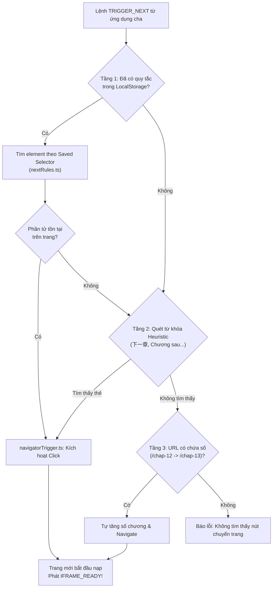

# 📁 Bộ Tự Động Chuyển Chương (Next Chapter Navigator)

> **Đường dẫn thư mục:** `frontend/src/utils/webview-injected/navigation`  
> **Kiến trúc:** Fractal Modular Clean Architecture (Tối đa 7 files/thư mục, $\le$ 300 dòng/file)  
> **Trách nhiệm cốt lõi:** Quản lý thuật toán nhận diện và tự động kích hoạt chuyển sang chương tiếp theo trong webview, giải phóng hoàn toàn thao tác tay của người đọc.

---

## 📌 Tổng Quan Thuật Toán Chuyển Chương 3 Tầng

Module `navigation` sử dụng thuật toán tìm kiếm 3 tầng dự phòng (Three-Tier Fallback Strategy):
1. **Tầng 1 - Ưu tiên quy tắc đã học (`nextRules.ts`):** Tra cứu trong `__tienhiep_novel_next_rules` xem người dùng đã từng chỉ định nút chuyển chương cho bộ truyện hoặc trang web này qua Tâm Ngắm hay chưa. Nếu có, lập tức sử dụng selector này.
2. **Tầng 2 - Heuristic phân tích ngữ nghĩa (`nextTarget.ts`):** Quét toàn bộ các thẻ liên kết `<a>` và nút bấm `<button>` chứa từ khóa chuyển chương:
   - Tiếng Trung: `"下一章"`, `"下一页"`, `"后一章"`, `"下章"`, `"next"`.
   - Tiếng Việt: `"Chương sau"`, `"Chương tiếp"`, `"Tiếp theo"`, `"Trang sau"`.
3. **Tầng 3 - Dự đoán URL tự tăng dần (URL Heuristic):** Nếu trên trang không có liên kết rõ ràng, hệ thống phân tích cấu trúc URL hiện tại (ví dụ: `.../chapter-12.html`), tự động tăng số hiệu lên 1 (`.../chapter-13.html`) và phát yêu cầu điều hướng.
4. **Bộ kích hoạt chuyển trang an toàn (`navigatorTrigger.ts`):** Mô phỏng chuỗi sự kiện người dùng thật (`mousedown -> mouseup -> click` hoặc gán `window.location.href`) để vượt qua các lớp chặn script của một số trang web.

---

## 📊 Sơ Đồ Thuật Toán Tìm Nút Sang Chương (Mermaid Flowchart)

---

## 📄 Chi Tiết Từng Tệp Tin Trong Thư Mục

| Tên Tệp Tin | Dòng Code | Vai Trò & Thuật Toán Trọng Tâm | Các Exports Chính |
| :--- | :---: | :--- | :--- |
| [`index.ts`](file:///home/alida/Documents/Extension_reader_tool/ttS/frontend/src/utils/webview-injected/navigation/index.ts) | 13 | Điểm xuất khẩu tích hợp module Navigation vào kịch bản bundle injected. | `getInjectedNavigationScript` |
| [`navigatorTrigger.ts`](file:///home/alida/Documents/Extension_reader_tool/ttS/frontend/src/utils/webview-injected/navigation/navigatorTrigger.ts) | 210 | Bộ máy thực thi hành động click: mô phỏng chuỗi sự kiện người dùng đầy đủ (`dispatchEvent MouseEvent`), kiểm tra thuộc tính href, xử lý chuyển trang bằng `window.location`. | `getNavigatorTriggerScript` |
| [`nextRules.ts`](file:///home/alida/Documents/Extension_reader_tool/ttS/frontend/src/utils/webview-injected/navigation/nextRules.ts) | 145 | Quản lý logic tra cứu quy tắc chuyển chương: đọc dữ liệu từ `localStorage`, phân giải khóa domain và tên truyện, hỗ trợ quy tắc fallback `_last`. | `getNavigationRulesScript` |
| [`nextTarget.ts`](file:///home/alida/Documents/Extension_reader_tool/ttS/frontend/src/utils/webview-injected/navigation/nextTarget.ts) | 211 | Thuật toán quét ngữ nghĩa: mảng từ khóa đa ngôn ngữ, phân tích DOM để định vị nút bấm mục tiêu và phân tích quy luật tự tăng số thứ tự URL. | `getNextTargetScript` |

---
*Tài liệu được cập nhật tự động đồng bộ theo hệ thống Tiên Hiệp AI Clean Architecture.*
