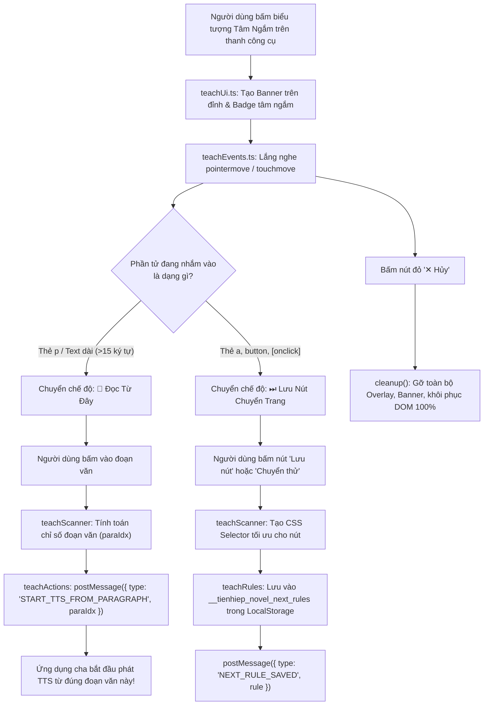

# 📁 Chế Độ Tâm Ngắm Chỉ Định Thông Minh (Teach Mode)

> **Đường dẫn thư mục:** `frontend/src/utils/webview-injected/teacher`  
> **Kiến trúc:** Fractal Modular Clean Architecture (Tối đa 7 files/thư mục, $\le$ 300 dòng/file)  
> **Trách nhiệm cốt lõi:** Cung cấp lớp phủ giao diện tâm ngắm trực quan trên webview để người dùng chỉ định nút chuyển chương (Next Chapter Selector) hoặc chạm chỉ định đọc sách ("📖 Đọc từ đây").

---

## 📌 Tổng Quan Chức Năng Tâm Ngắm

Nhiều trang web tiểu thuyết có cấu trúc HTML phức tạp, đặt nút chuyển chương trong các thẻ ẩn hoặc đổi tên class liên tục khiến thuật toán tự động khó nhận diện. Module `teacher` giải quyết triệt để vấn đề này:
1. **Lớp phủ tâm ngắm tương tác (Visual Crosshair Overlay):** Di chuyển theo ngón tay hoặc con trỏ chuột, tự động bắt dính (snap) vào các nút bấm hoặc đoạn văn bản gần nhất.
2. **Cơ chế phản hồi tức thì trên Mobile (Instant Action Binding):** Hàm `bindInstantAction` gắn kết đồng thời cả 3 sự kiện `pointerdown`, `touchstart` và `click`, triệt tiêu hoàn toàn độ trễ 300ms của trình duyệt trên điện thoại cảm ứng.
3. **Phân biệt nút chuyển trang và đoạn văn bản:**
   - Nếu tâm nhắm vào nút/liên kết (`<a>`, `<button>`): Banner hiển thị chế độ **"Lưu nút chuyển chương"** và nút **"⏭ Chuyển Thử"**.
   - Nếu tâm nhắm vào văn bản (`
`, `data-tts-idx` hoặc text dài): Banner và badge tự động chuyển sang chế độ **"📖 Đọc từ đây"**.
4. **Học quy tắc theo tên truyện & domain (`__tienhiep_novel_next_rules`):** Lưu quy tắc theo cấu trúc `{ [domain]: { [novelKey]: selector, _last: selector } }`. Chỉ cần kéo tâm 1 lần duy nhất, toàn bộ các chương tiếp theo sẽ tự động chuyển trang chính xác.
5. **Nút hủy dọn sạch 100% DOM (`__cancel_teach_next`):** Khi người dùng bấm nút đỏ **"✕ Hủy"**, toàn bộ lớp phủ, banner, sự kiện và biến cờ `window.__isTeachingNext` đều bị xóa sạch, trả lại trang web nguyên bản không chút tì vết.

---

## 📊 Sơ Đồ Quy Trình Hoạt Động Của Tâm Ngắm (Mermaid Flowchart)

---

## 📄 Chi Tiết Từng Tệp Tin Trong Thư Mục

| Tên Tệp Tin | Dòng Code | Vai Trò & Thuật Toán Trọng Tâm | Các Exports Chính |
| :--- | :---: | :--- | :--- |
| [`index.ts`](file:///home/alida/Documents/Extension_reader_tool/ttS/frontend/src/utils/webview-injected/teacher/index.ts) | 21 | Điểm khởi đầu của module Teacher, xuất hàm `getInjectedTeacherScript` để tích hợp vào bundle tiêm vào webview. | `getInjectedTeacherScript` |
| [`teachActions.ts`](file:///home/alida/Documents/Extension_reader_tool/ttS/frontend/src/utils/webview-injected/teacher/teachActions.ts) | 107 | Xử lý các hành động khi bấm nút: lưu rule chuyển chương (`saveNextRule`), xóa rule mặc định (`deleteNextRule`), chuyển trang thử nghiệm (`triggerNavigation`) và phát sự kiện `START_TTS_FROM_PARAGRAPH`. | `getTeachActionsScript` |
| [`teachControls.ts`](file:///home/alida/Documents/Extension_reader_tool/ttS/frontend/src/utils/webview-injected/teacher/teachControls.ts) | 300 | Cung cấp hàm `bindInstantAction` (kích hoạt tức thì với `pointerdown/touchstart/click`), khởi tạo giao diện các nút điều khiển trên banner (Hủy, Mặc định, Lưu, Chuyển thử). | `getTeachControlsScript` |
| [`teachEvents.ts`](file:///home/alida/Documents/Extension_reader_tool/ttS/frontend/src/utils/webview-injected/teacher/teachEvents.ts) | 196 | Bắt và xử lý các sự kiện chuột và chạm (`pointermove`, `pointerdown`, `touchmove`, `touchend`), tính toán tọa độ để di chuyển con trỏ tâm ngắm bám theo ngón tay người dùng. | `getTeachEventsScript` |
| [`teachRules.ts`](file:///home/alida/Documents/Extension_reader_tool/ttS/frontend/src/utils/webview-injected/teacher/teachRules.ts) | 105 | Quản lý cơ sở dữ liệu rule chuyển chương theo domain và tên truyện (`__tienhiep_novel_next_rules`), cơ chế fallback `_last` thông minh cho các truyện cùng trang web. | `getTeachRulesScript` |
| [`teachScanner.ts`](file:///home/alida/Documents/Extension_reader_tool/ttS/frontend/src/utils/webview-injected/teacher/teachScanner.ts) | 223 | Thuật toán quét và nhận diện phần tử: tạo chuỗi selector CSS độc nhất cho nút bấm, phân tích các khối văn bản chính để tính toán chính xác chỉ số đoạn văn (`paraIdx`). | `getTeachScannerScript` |
| [`teachUi.ts`](file:///home/alida/Documents/Extension_reader_tool/ttS/frontend/src/utils/webview-injected/teacher/teachUi.ts) | 62 | Khởi tạo khung giao diện banner cố định trên cùng (`#tienhiep-teach-banner`) và huy hiệu tâm ngắm bay nổi trên trang web. | `getTeachUiScript` |

---

## ⚙️ Quy Chuẩn Trải Nghiệm Người Dùng (UX Principles)

1. **Zero Lag:** Thao tác chạm được gắn kết bằng `pointerdown` / `touchstart` loại bỏ độ trễ phản hồi, người dùng chạm vào nút là kích hoạt ngay lập tức.
2. **Clean DOM:** Toàn bộ thành phần UI của chế độ dạy nút đều được bao bọc trong các thẻ mang id tiền tố `__tienhiep_` và được gỡ bỏ tuyệt đối khỏi DOM khi đóng, không làm biến dạng giao diện gốc của trang truyện.

---
*Tài liệu được cập nhật tự động đồng bộ theo hệ thống Tiên Hiệp AI Clean Architecture.*
