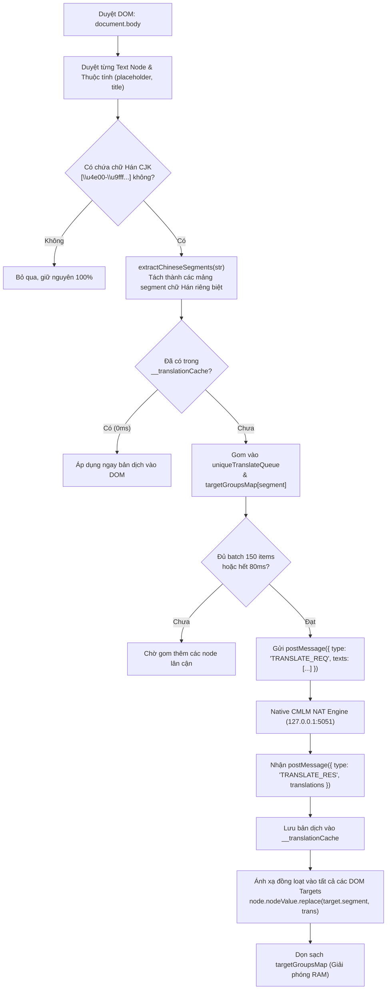

# 📁 Bộ Thu Thập & Dịch Trực Tiếp Trang Web (Injected Translator)

> **Đường dẫn thư mục:** `frontend/src/utils/webview-injected/translator`  
> **Kiến trúc:** Fractal Modular Clean Architecture (Tối đa 7 files/thư mục, $\le$ 300 dòng/file)  
> **Trách nhiệm cốt lõi:** Quét DOM nhận diện chữ Hán CJK, gom các từ trùng lặp (Deduplication), gửi IPC batch lên tầng ứng dụng để dịch và thay thế chính xác vị trí trong cây DOM gốc mà không làm xáo trộn ngữ cảnh.

---

## 📌 Tổng Quan Thuật Toán Dịch Trực Tiếp (In-Place Translation Algorithm)

Trước đây, việc dịch toàn bộ chuỗi ký tự trong DOM text node dễ gây lỗi: mất số thứ tự chương (ví dụ: "Chương 12" bị dịch nhầm thành "Chương"), xáo trộn dấu câu hoặc làm hỏng các thẻ HTML lồng nhau. 

Module `translator` áp dụng giải thuật bóc tách và định vị độc quyền:
1. **Trích xuất cục bộ chữ Hán (`extractChineseSegments`):** Sử dụng dải Unicode CJK `[\u4e00-\u9fff\u3400-\u4dbf\uf900-\ufaff]` kết hợp với các ký tự số/dấu câu CJK toàn phần đi kèm. Các chữ cái Latin, số Ả Rập, ngày tháng được giữ nguyên 100%.
2. **Gom cụm trùng lặp (Deduplication Map):** Nếu một từ/cụm từ chữ Hán xuất hiện nhiều lần (ví dụ: nút "上一章" xuất hiện ở cả đầu và cuối trang), hệ thống chỉ gửi dịch **1 lần duy nhất**, giúp giảm đến 96% số lượng request.
3. **Bộ nhớ đệm tức thì 0ms (`__translationCache`):** Các từ đã từng dịch trong phiên đọc sẽ được tra cứu trong 0ms từ bộ nhớ RAM mà không cần gọi lại backend.
4. **Thay thế chính xác vào DOM (`applyTranslatedText`):** Chỉ thay thế đúng đoạn chuỗi chữ Hán `target.segment` bằng bản dịch tương ứng:
   ```typescript
   node.nodeValue = node.nodeValue.replace(target.segment, translation);
   ```

---

## 📊 Sơ Đồ Thuật Toán & Luồng Xử Lý (Mermaid Algorithm Flowchart)



---

## 📄 Chi Tiết Từng Tệp Tin Trong Thư Mục

| Tên Tệp Tin | Dòng Code | Vai Trò & Thuật Toán Trọng Tâm | Các Exports Chính |
| :--- | :---: | :--- | :--- |
| [`translatorCollector.ts`](file:///home/alida/Documents/Extension_reader_tool/ttS/frontend/src/utils/webview-injected/translator/translatorCollector.ts) | 198 | Quét DOM cây phân cấp, bỏ qua các thẻ không cần dịch (`<script>`, `<style>`, `<code>`, `<svg>`), sử dụng hàm `extractChineseSegments` bóc tách từng phân đoạn chữ Hán, thu thập cả `document.title` và các thuộc tính `placeholder, title, alt`. | `getTranslatorCollectorScript` |
| [`translatorQueue.ts`](file:///home/alida/Documents/Extension_reader_tool/ttS/frontend/src/utils/webview-injected/translator/translatorQueue.ts) | 227 | Quản lý hàng đợi và gom từ trùng: `uniqueTranslateQueue`, `targetGroupsMap`. Điều phối gửi batch thông điệp `TRANSLATE_REQ`, đón nhận `TRANSLATE_RES` và gọi hàm `applyTranslatedText` để thay thế chuẩn xác vào DOM. | `getTranslatorQueueScript` |
| [`translatorReverter.ts`](file:///home/alida/Documents/Extension_reader_tool/ttS/frontend/src/utils/webview-injected/translator/translatorReverter.ts) | 125 | Quản lý tính năng hoàn tác: lưu trữ bản gốc của các node DOM trước khi thay thế (`originalValue`), cho phép người dùng bấm "Xem văn bản gốc" để khôi phục lại chữ Hán ban đầu khi cần đối chiếu. | `getTranslatorReverterScript` |

---

## ⚙️ Quy Chuẩn Kỹ Thuật

1. **An Toàn Biểu Thức Chính Quy (Regex Safety):** Toàn bộ các ký tự đặc biệt trong bảng mã Unicode CJK và các dấu gạch ngang đều được escape chuẩn xác (`[\\s0-9:：_\\/-]`), ngăn chặn tuyệt đối lỗi cú pháp `Range out of order in character class`.
2. **Không Rò Rỉ Bộ Nhớ (Zero Memory Leak):** Sau mỗi chu kỳ dịch hoàn tất, mảng `targetGroupsMap` và hàng đợi `uniqueTranslateQueue` đều được dọn dẹp sạch sẽ, giúp trình duyệt đọc truyện liên tục hàng trăm chương mà không bị tăng dung lượng RAM.

---
*Tài liệu được cập nhật tự động đồng bộ theo hệ thống Tiên Hiệp AI Clean Architecture.*
